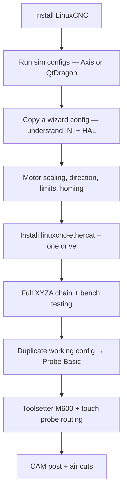

# Getting started — zero to hero

This repo is a **working reference config** for a Lemontart-class EtherCAT mill with Probe Basic. It is **not** a guaranteed drop-in: most of it was assembled from examples, forum posts, and trial-and-error. Treat upstream docs as authoritative; use this repo to see how one specific machine wires things together.

## Before you copy anything

| Expect to change | Why |
|------------------|-----|
| EtherCAT NIC address | Your `ip a` result ≠ ours |
| `ethercat-conf.xml` slave order / PDOs | Chain layout and drive firmware |
| `[JOINT_*] SCALE`, limits, homing | Ball screws, encoders, switch placement |
| `h100.mb2hal` serial port | `/dev/ttyUSB0` is not universal |
| `PROGRAM_PREFIX` in `ethercat_mill.ini` | Currently a developer path; point at your `nc_files/` |
| Probe tool number (default T99) | Must match tool table, `#3014`, and HAL — see [TOOLSETTER.md](TOOLSETTER.md) |

## Recommended learning path

Probe Basic adds a lot of moving parts. If LinuxCNC is new to you, **do not start here**. Build confidence on a simpler config first.



### Stage 0 — Install LinuxCNC

- Downloads: [linuxcnc.org/downloads](https://linuxcnc.org/downloads/)
- Official docs: [LinuxCNC documentation](https://linuxcnc.org/docs/html/)
- HAL primer: [HAL introduction](https://linuxcnc.org/docs/html/hal/intro.html)
- INI reference: [INI file parameters](https://linuxcnc.org/docs/html/config/ini-config.html)

### Stage 1 — Simulation and UI

Run a stock sim config (e.g. `sim/axis/axis.ini`) and learn:

- Machine On / Estop / Home All
- Jogging, MDI (`G0`, `G1`, `G53`, `G54`)
- **Show HAL Configuration** — watch pins change when you jog
- **HAL Meter** on `joint.N.motor-pos-cmd` vs `motor-pos-fb`

Probe Basic is QtPyVCP-based. Skim upstream UI docs even if you use Axis first:

- [Probe Basic](https://github.com/kcjengr/probe_basic) (install instructions match your LinuxCNC version)
- [QtPyVCP](https://github.com/kcjengr/qtpyvcp)

### Stage 2 — EtherCAT + StepperOnline A6

This machine uses **linuxcnc-ethercat** (`lcec`) with **CiA 402** drives:

- Project: [linuxcnc-ethercat](https://github.com/linuxcnc-ethercat/linuxcnc-ethercat)
- Our slave layout: [`ethercat-conf.xml`](ethercat-conf.xml) (4× generic A6-class slaves, VID `00400000` PID `00000715`)
- HAL load order: [`ethercat_loadusr.hal`](ethercat_loadusr.hal) (`#NOTWOPASS`) then [`ethercat_mill.hal`](ethercat_mill.hal)

**First-time EtherCAT checklist**

1. Install IgH EtherCAT master + `lcec` per project README.
2. Set master MAC in `/etc/ethercat.conf` (from `ip link` on the dedicated NIC).
3. `ethercat slaves` — confirm 4 slaves, correct order.
4. Start with **one axis** enabled in HAL; verify `halcmd show pin lcec.0.0.pos-fb` moves when you turn the motor by hand.
5. Tune drives in StepperOnline software **before** aggressive homing.

Drive docs (vendor):

- [StepperOnline closed-loop stepper manuals](https://www.omc-stepperonline.com/download-manual)

### Stage 3 — Homing, limits, bench mode

Homing and limit wiring live in [`ethercat_mill.hal`](ethercat_mill.hal), not the INI. See [README.md](README.md#current-machine-behavior-captured-config) for the DI map.

**Bench / breakout shortcuts** (revert before production — details in [DEVIATIONS.md](DEVIATIONS.md#bench--breakout-shortcuts)):

- `NO_FORCE_HOMING = 1` in `ethercat_mill.ini` — can run without homing
- REF ALL order is Z → X → Y → A (`HOME_SEQUENCE` 0/1/2/3). A uses zero search/latch — marks homed at current position (no switch)
- Z/A limits and A home **gagged** via `and2.0` in HAL while X/Y use real switches

### Stage 4 — Spindle (H100 VFD + Modbus)

- [`h100.mb2hal`](h100.mb2hal) — register map; set `SERIAL_PORT`
- [`custom.hal`](custom.hal) — RPM scaling, at-speed compare + 5 s settle, fault → estop

H100 manual: search vendor PDF for register `0x0201` (freq set), `0x000A` (current fault).

Modbus HAL: [mb2hal documentation](https://linuxcnc.org/docs/html/man/man1/mb2hal.1.html)

### Stage 5 — Pendant (XHC WHB04B-6)

- [`xhc-whb04b-6.hal`](xhc-whb04b-6.hal) — MPG jog with `ilowpass` smoothing, feed override to 250%
- Component: [xhc-whb04b-6](https://github.com/welter/welder/tree/master/xhc-whb04b-6) (check your package source)

With bench homing disabled, pendant “axis homed” gates are tied to `halui.machine.is-on` so Z jogging is not blocked.

### Stage 6 — Probe Basic migration

When XYZ motion is trustworthy:

1. Copy this repo’s `probe_basic/` tree and INI `[DISPLAY]` / `[RS274NGC]` sections.
2. Align [`probe_basic/pb_required_ini_settings.ini`](probe_basic/pb_required_ini_settings.ini) with your INI (geometry, paths, `OWORD_NARGS`, etc.).
3. Launch: [`launch.sh`](launch.sh) or `linuxcnc /path/to/ethercat_mill.ini`
4. Teach toolsetter and probe params — [TOOLSETTER.md](TOOLSETTER.md)
5. UI extras — [PROBE_BASIC_UI.md](PROBE_BASIC_UI.md)

### Stage 7 — CAM

- Fusion post: [`linuxcnc-djr.cps`](linuxcnc-djr.cps) — see [TOOLSETTER.md § CAM](TOOLSETTER.md#cam--post-processor-linuxcnc-djrcps)
- Default tool change: **`T<n> M600`** (toolsetter probe), not stock `M6` motion

## How the config fits together

```
ethercat_mill.ini
├── [HAL] TWOPASS load order
│   ├── ethercat_loadusr.hal   → lcec_conf + ethercat-conf.xml (once)
│   ├── ethercat_mill.hal      → joints, limits, probe mux, estop
│   ├── xhc-whb04b-6.hal       → pendant
│   └── custom.hal             → VFD Modbus, at-speed, faults
├── POSTGUI probe_basic/probe_basic_postgui.hal
├── probe_basic/custom_config.yml
├── probe_basic/subroutines/   → probing, M600, tool change
└── nc_files/                  → PROGRAM_PREFIX (edit path!)
```

| Subsystem | Primary files | Deep dive |
|-----------|---------------|-----------|
| Motion + EtherCAT | `ethercat_mill.ini`, `ethercat_mill.hal`, `ethercat-conf.xml` | [README](README.md), [DEVIATIONS](DEVIATIONS.md) |
| Toolsetter + touch probe | `tool_touch_off.ngc`, `m600.ngc`, HAL probe gating | [TOOLSETTER.md](TOOLSETTER.md) |
| Probe Basic UI | `probe_basic/`, custom DRO | [PROBE_BASIC_UI.md](PROBE_BASIC_UI.md) |
| Metrology macros | `probe_z_three_samples.ngc`, etc. | [probe_basic/subroutines/metrology/README.md](probe_basic/subroutines/metrology/README.md) |
| CAM | `linuxcnc-djr.cps` | [TOOLSETTER.md](TOOLSETTER.md) |

## First boot on this repo

1. Clone repo; `cd` into it.
2. Edit `ethercat_mill.ini`:
   - `PROGRAM_PREFIX` → your `nc_files` directory (repo includes `./nc_files/`).
3. Edit `/etc/ethercat.conf` and `ethercat-conf.xml` for your NIC and slaves.
4. Edit `h100.mb2hal` → `SERIAL_PORT`.
5. `./launch.sh` (sets `QT_QUICK_BACKEND=software` for Qt Quick on some GPUs).
6. **Machine On** → if estop loops, check Slave 3 DI1 (software estop NC).
7. Home X/Y (Z/A behavior depends on bench flags — read [DEVIATIONS.md](DEVIATIONS.md)).
8. MDI smoke test: `G0 X10`, `M3 S500`, watch `halcmd show pin spindle.0.at-speed`.

## Day-one operator workflows

| Task | How |
|------|-----|
| Load cutter + measure length | Probe Basic **LOAD SPINDLE** or CAM `T<n> M600` |
| Load touch probe only | **LOAD SPINDLE** with probe tool — skips M600 |
| Set WCO Z after shim touch-off | XYZA DRO **SET Z** field → [PROBE_BASIC_UI.md](PROBE_BASIC_UI.md) |
| Touch-off without CAM | **TOUCH OFF CURRENT TOOL** |
| WCS probing | Probe tab routines (requires T99 / `#3014` aligned) |
| Repeatability check | `o<probe_z_repeat_stats> call [10]` — [metrology README](probe_basic/subroutines/metrology/README.md) |

## Troubleshooting

| Symptom | Things to check |
|---------|-----------------|
| `lcec_conf` fails / no slaves | `ethercat master`, NIC in `/etc/ethercat.conf`, cable power order |
| Enable drops immediately | Software estop DI1, drive fault `cia402.N.drv-fault`, VFD fault code on `spindle-vfd-fault-code` |
| Probe never trips | Wrong tool in spindle for HAL route (T99 vs cutter), DI wiring, `motion.probe-input` with `halcmd` |
| M600 does not probe | `#5181–#5183` unset, `#3010` spindle zero unset, `TOOL_CHANGE_AT_G30=0` (expected — macro handles motion) |
| Pendant Z jog blocked | Homing flags — see `xhc-whb04b-6.hal` machine.is-on tie-in |
| Spindle runs wrong direction | `custom.hal` M3/M4 swap comment — `REVERT` line |
| Fusion post missing M600 / 4th axis | Cached post — [TOOLSETTER.md](TOOLSETTER.md#cam--post-processor-linuxcnc-djrcps) |
| Probe Basic spindle RPM blank | `probe_basic_postgui.hal` must net `spindle-speed-in` (already done here; stock hallib uses `scale_to_rpm` from sim) |

**Useful commands**

```bash
halcmd show pin motion.probe-input
halcmd show pin halui.tool.number
halcmd watchpin spindle-at-speed-raw
ethercat slaves
```

## External examples this config borrowed from

| Source | What we took |
|--------|----------------|
| [TooTall18T/tool_length_probe](https://github.com/TooTall18T/tool_length_probe) v5.0.2 | `tool_touch_off.ngc`, M600 flow, G30 teach |
| [kcjengr/probe_basic](https://github.com/kcjengr/probe_basic) | UI shell, probe routines, `pb_required_ini_settings.ini` |
| [linuxcnc-ethercat](https://github.com/linuxcnc-ethercat/linuxcnc-ethercat) | `lcec` + CiA402 patterns |
| LinuxCNC stock sim configs | HAL/INI structure, `trivkins` |
| Forum / Discord snippets | WHB pendant filter, VFD at-speed delay, probe input mux |

We do **not** claim these integrations are the only correct approach — they are what works on this machine today.

## Safety

Verify estop, drive enables, and spindle interlocks on the bench before cutting. Comments tagged `BREAKOUT OFF` and `REVERT` mark temporary wiring or INI shortcuts that are **unsafe for unattended production**.
