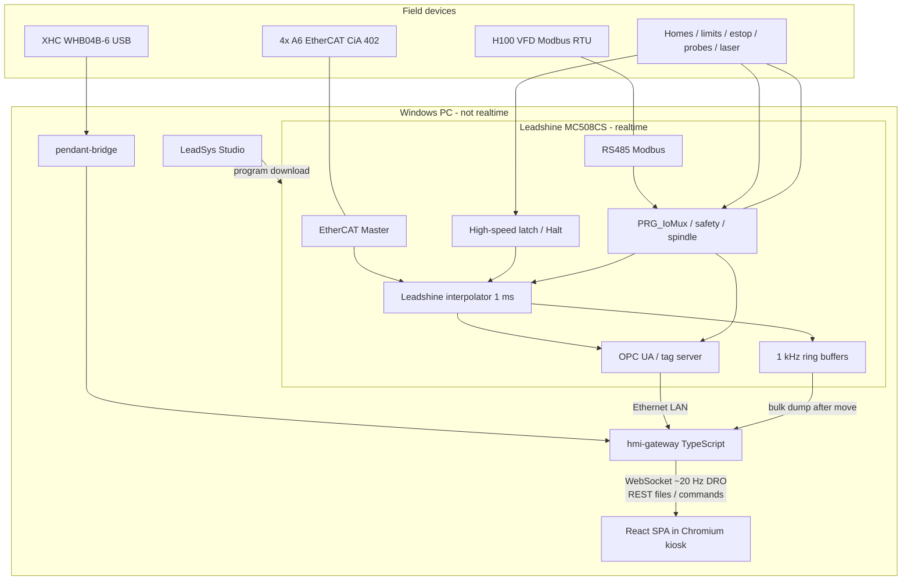
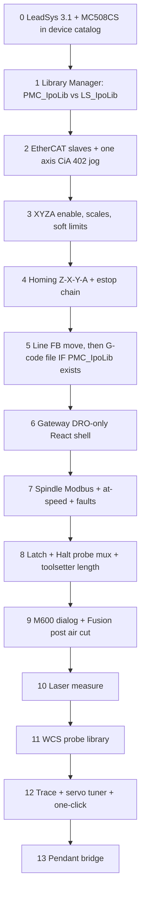

# Replicating this mill on CODESYS + a browser HMI

Yes — a browser HMI is the right call, as long as one rule is never broken:

**The browser paints. The PLC moves metal.**

E-stop, interpolator, probe latch, drive enables, and following-error trips stay on a real-time CODESYS runtime. The browser is a very fast remote control and dashboard. That split is what makes rapid UI prototyping safe instead of scary.

This page is the architecture and program map for porting **this repo’s features** (not “a generic CNC”) onto that stack. LinuxCNC stays the working machine until the CODESYS side can run air cuts.

Features should not be baked into one blob. A small kernel plus opt-in packs is in **[CODESYS_PLUGINS.md](CODESYS_PLUGINS.md)** (machine profile, contribution points, why we will not auto-scan folders).

**Motion on the candidate brick is Leadshine interpolator FBs, not CODESYS Store SoftMotion CNC.** Pin-level facts from the Jan 2025 command manual: **[LEADSHINE_LIBRARIES.md](LEADSHINE_LIBRARIES.md)**. G-code FBs are `PMC_IpoLib` (PMC600 chapter). Chapter-4 `LS_IpoLib` is line/circle/sequence only. That PDF does not settle whether **MC508CS** ships `PMC_IpoLib`.

---

## What “all these features” actually means

This mill is not just four servos and a G-code player. The current LinuxCNC config is a bundle of subsystems that have to be rebuilt as **IEC programs + a web app**, not copied as `.ngc` files.

| Area | What exists today | Why it matters on this brick |
|------|-------------------|------------------------------|
| Motion | XYZA `trivkins`, 1 ms servo, EtherCAT CiA 402 A6 drives | Leadshine interp: `LS_IpoLib` (line) and, **if the SKU has it**, `PMC_IpoLib` G-code. Mill **A** is not a documented G-word. |
| UI | Probe Basic (QtPyVCP): DRO, jog, AUTO/MDI, offsets, probe tab, custom tabs | React SPA replacing the whole shell |
| Tool length | `T n M600` → park, dialog, contact setter, `G10`/`G43` | ST handler + latch + Halt. No G43 in the book. 4-axis G-code FB has no `wM`/`AcknM`. |
| Tool diameter | Kexin laser tab + `laser_*.ngc` + HAL mux | Same mux in ST; measure cycles as ST (not a G38 skip) |
| Touch probe | Probe Basic pocket/boss/corner/angle macros (~50 `.ngc`) | ST probe library + hardware latch; not G31/G38 |
| Spindle | H100 VFD over Modbus, 5 s at-speed delay, fault → estop | PLC Modbus master (MC508CS has RS485) + same interlocks |
| Pendant | XHC WHB04B-6 USB + jog smoothing | Userspace bridge on the Windows PC (no native CODESYS driver) |
| Tuning | Servo Tuning tab, one-click auto-tune, LLM clipboard loop | High-rate PLC trace + TypeScript FFT (not in the PLC) |
| Logging | HAL CSV + live plot up to 1 kHz | PLC ring buffer dump, not browser polling |
| CAM | Fusion post `linuxcnc-djr.cps` (M600, XYZA, G93) | New post. G93 / G43 / G64 are **unproven** on Leadshine G-code FBs. |

---

## Recommended stack (the one that would actually impress people)

Skip CODESYS WebVisu as the main operator UI. It is fine for a maintenance page. It will not give you Probe Basic’s plots, a 3D backplot, or a week of UI iteration without touching the PLC.

**Pick this:**

| Layer | Choice | One-sentence why |
|-------|--------|------------------|
| PLC runtime | **Leadshine MC508CS** (LeadSys / CODESYS 3.5 SP15-class) | Brick owns EtherCAT + IO + RS485; not Store Control for Linux SL |
| Motion | **Leadshine `LS_IpoLib` / `PMC_IpoLib`** | Line FBs in ch. 4; G-code FBs are PMC600 / `PMC_IpoLib` if that SKU ships them. **Not** Store `SMC_Interpolator`. |
| Fieldbus | Brick EtherCAT master + RS485 Modbus | A6s on EtherCAT only; H100 on RS485; PC Ethernet is HMI/IDE, not the drive bus |
| Tag bus | OPC UA on the brick (or LeadSys equivalent) | HMI never talks EtherCAT |
| Gateway | **Node + TypeScript + `node-opcua` + WebSocket** (Fastify or Hono) | Same language as the HMI; browsers cannot speak OPC UA |
| HMI | **React + TypeScript + Vite + TanStack + Tailwind + shadcn/ui** | Largest hiring pool; kiosk SPA without Next.js — see [Hirability](#the-honest-choice-for-hirability) |
| Charts | **uPlot** (FERR / torque) | Tiny and fast enough for live traces |
| Backplot | **Three.js** | 3D XYZA toolpath that Probe Basic cannot match |
| Repo layout | **pnpm workspace + `plugins/<id>/` packs** | Kernel apps + vertical feature slices; see [CODESYS_PLUGINS.md](CODESYS_PLUGINS.md) |

What those names mean if you are new to web tooling:

- **React** — the UI library (buttons, DRO, tabs). Not the mill; just the kiosk screens. See [Hirability](#the-honest-choice-for-hirability).
- **TypeScript** — JavaScript with types. Catches “wrote RPM into a bool” before you hit the machine. This is the actual resume line.
- **Vite** — the dev server. Save a file, the kiosk browser hot-reloads in milliseconds. That is the rapid prototyping. Use it *instead of* Next.js on this machine.
- **TanStack Router / Query** — routing and server-state. What React shops actually want in 2026, without a Next.js server.
- **Tailwind / shadcn/ui** — styling without fighting CSS files. Dark mill theme in days, not months. shadcn is a hiring signal; shadcn-vue is not.
- **Hono or Fastify** — small TypeScript HTTP/WebSocket server. Not the motion controller. The hireable skill is Node + TypeScript, not the brand of framework.
- **OPC UA** — how respectable industrial software reads/writes PLC variables. Think “typed HAL pins over the network.”
- **pnpm** — installs JS packages once and shares them across `apps/hmi` and `apps/gateway`.

**Not Node-RED, not Next.js on the mill, not putting the interpolator in JavaScript.** Node-RED is a glue toy. Next.js is built for websites (server HTML, SEO). A mill kiosk has neither, and a WebSocket that must stay up. A browser cannot close a 1 ms position loop.

WebVisu can still ship as a **backup/maintenance page** (force enable, raw IO) so you can recover if the SPA is down.

---

## The honest choice for hirability

Optimize for **who you can hire** (and what transfers if you leave), not for what is slightly nicer to learn.

### What the mill application is

The operator UI is a **kiosk single-page app**. Vue, React, and Svelte can all do that. The mill itself is still CODESYS + gateway + SPA. Framework choice does not change EtherCAT.

### If the question is web-job / contributor pool: React + TypeScript + Vite

US and general software hiring still looks like this, by a wide margin:

| Skill | Hiring reality |
|-------|----------------|
| **TypeScript** | Table stakes. This matters more than React vs Vue. |
| **React** | Default frontend on job posts. Bootcamps, contractors, “we need a UI person next month.” |
| **Next.js** | On a huge number of *postings*. Still the **wrong runtime** for this kiosk. Learn it on a website if you want the buzzword; do not run it on the mill. |
| **Vue 3** | Real #2. Employable, especially EU / Laravel / some product companies. Smaller pool when you post “HMI engineer, 3-month contract.” |
| **Svelte** | Passion market. You will wait longer to hire. |
| **Hono** | Almost nobody lists it. Node + TypeScript is what they list. |
| **CODESYS ST + EtherCAT + Leadshine interp** | Tiny pool, high rate, *different industry*. This is the rare skill if you want automation OEM work — not a substitute for React if you want a web hire. |

**The hireable mill HMI stack:** React + TypeScript + Vite + TanStack Router/Query + Tailwind + shadcn/ui + uPlot + Three.js.

That is the same kiosk architecture as Vue+Vite. You are not “selling out” to Next.js. You are picking the library the largest number of frontend people already have in muscle memory.

**Vue is not a career dead end.** It is the right pick if *you* want to write it and you are not hiring. It is the wrong pick if the point of the stack is “a random strong frontend can sit down and contribute.”

**Do not pick Next.js for hirability of the machine.** You would be stuffing a website framework into a shop-floor process so resumes parse. Staffing is solved by React on the resume *and* Vite in `apps/hmi`. Candidates who only know Next can still work in React; you do not need the Next server.

### If the question is industrial automation jobs

React vs Vue is a rounding error. **Structured Text, CiA 402, EtherCAT, Leadshine interpolator FBs, OPC UA** are what that market cannot find. A Vue-only mill HMI does not get you a PLC job; a React-only mill HMI does not either.

### Gateway

Node + TypeScript is the hireable gateway (same language as the HMI, one interview loop). Python (`asyncua`) is the hireable choice if you staff from LinuxCNC/scientific people — this repo is already Python. Do not pick Python vs Node for fashion; pick who you want to hire. Default here: **Node + TypeScript**, because the HMI hire already speaks it.

### Capability is a tie

| | Vue 3 + Vite | React + Vite | Svelte 5 + Vite | Next.js |
|--|--------------|--------------|-----------------|---------|
| Kiosk SPA | Yes | Yes | Yes | Wrong shape |
| Beginner slope | Gentlest | Steeper | Small API, fewer mill tutorials | Extra concepts you do not need |
| Hiring pool (web) | #2 | **#1** | Niche | #1 on *postings*, still wrong here |
| 20 Hz DRO / Three.js | All fine | All fine | All fine | N/A |

---

## System architecture



Split of duties:

1. **MC508CS** — hard realtime. Owns EtherCAT to the A6s, RS485 to the H100, interpolator, safety, latch. Static IP on the PLC LAN.
2. **Windows PC** — Cursor + LeadSys IDE + `hmi-gateway` + Chromium kiosk. Direct Ethernet to the brick. Not Wi‑Fi. Not on the EtherCAT segment.
3. **HMI loss is not e-stop.** PLC hold/stop on heartbeat timeout. Physical e-stop still cuts mains.

The pendant stays a userspace program on the Windows PC (USB HID → gateway → tag write of jog commands). The brick will not grow a WHB04B driver for free.

LinuxCNC stays on the mill PC until this stack can run air cuts. Do not install Store CODESYS SP22 expecting it to match LeadSys SP15.

---

## Timing: what is fast, what is allowed to be slow

This is the difference between a mill and a web app.

| Signal | Rate | Where it lives | How the HMI sees it |
|--------|------|----------------|---------------------|
| Position command / CiA 402 PDO | 1 ms | Leadshine interpolator + EtherCAT | Never in the browser |
| Probe / laser latch | drive / PLC task | `PRG_ProbeMux` + latch FB + Halt | Result position, not the edge |
| E-stop / drive fault | PLC task | `PRG_Safety` | Status lamps |
| DRO, spindle RPM, overrides | 20–50 Hz | OPC UA subscription → WebSocket | Live labels |
| FERR / torque plot | 200–1000 Hz | PLC ring buffer | File/blob **after** the move (or a slow live downsample) |
| One-click tune FFT | after a stroke | gateway TypeScript | Same as today’s Python |
| G-code upload / tool table | on demand | REST | File picker |

Do **not** try to stream 1 kHz FERR through the browser as JSON. That is how the current Qt tab got laggy at 1000 Hz. Capture in the PLC, dump, plot.

---

## LinuxCNC vs Leadshine interpolator: the dialect split

The Jan 2025 command manual is **not** LinuxCNC RS274NGC and it is **not** a license for Store SoftMotion CNC. You cannot drop `probe_basic/subroutines/*.ngc` onto the brick and press Cycle Start. Pin-level source: [LEADSHINE_LIBRARIES.md](LEADSHINE_LIBRARIES.md).

| LinuxCNC today | What the Jan 2025 book actually documents |
|----------------|-------------------------------------------|
| `G0`/`G1` | Split defaults `DefaultVel` vs `DefaultVelFF` on `LS_4AxisGCode_File` (almost certainly rapid vs G01). **G01** is named. No full G-word catalog. |
| XYZA in one block | File FB is **X,Y,Z,U** (or sibling **X,Y,Z,P**). No A word. Not the Line-FB 3+1 follower. |
| `G38.2` / G31 skip | **Absent.** Halt/Stop only. Latch is hardware (`LS_HighSpeedLatch_*`, `LS_TouchProbe`, `LS_ZeroLatch_*`, drive EZ). |
| `M6` / `REMAP=M600` | **`wM` / `AcknM` only on `LS_6AxisGCodeAxisUVW_File`.** The 4-axis file FB has no M handshake. |
| `#5181` `#3014` `linuxcnc.var` | Persistent GVL / recipe / file. 6-axis FB also exposes `SMC_VarList` (DIN 66025-shaped). |
| `G10` / `G43` / `G92.1` | `dOffsetX..W` on the 6-axis FB = **zero-point**, not G43 tool-length. G43 is not mentioned. |
| `G64 P0.001` | FB params `LimitMaxAcc` / `LimitMaxAccJerk` (transition arcs). Not a G-word. |
| `G93` inverse time | **Not mentioned.** Do not post G93 until proven. |
| S-curve | `VelocityMode` 0 TRAPEZOID / 1 SIGMOID / 3 QUADRATIC + `Jerk` (required ≠ 0 if mode 3). `VelRatio` 0.01–2 feed override. |
| HAL `motion.probe-input` mux | `PRG_ProbeMux` selecting which DI/latch ST will Halt on |
| `halui` / `iocontrol` | OPC UA command structs (`Cmd.FeedHold`, `Cmd.Mdi`, …) |

CAM consequence: **`post-processor/linuxcnc-djr.cps` does not come along.** A Fusion post that emits X/Y/Z/U (or P), M-codes the chosen FB can handshake, and **no** unproven G43/G31/G64/G93 is a first-class program in this port.

Probing is **ST + fast DI / high-speed latch + Halt/Stop**, not a G-code skip cycle. That replaces LinuxCNC G38 for this brick until a skip input shows up in installed F1 help.

---

## Logical programs (what you actually write)

Think in four buckets. Names below are the working titles to use in the CODESYS tree and the pnpm apps.

### 1. CODESYS application (IEC Structured Text)

CODESYS “programs” are POUs. Use **Structured Text** everywhere (closest to Python; do not start in ladder unless you enjoy pain).

| POU | Cycle | Job |
|-----|-------|-----|
| `PRG_Safety` | 1 ms bus task | E-stop chain (Slave 3 DI1), drive faults, VFD 64/92 → disable |
| `PRG_Cia402` | 1 ms | CiA 402 state machine per axis, scale, 6065/6066 windows |
| `PRG_Interpolator` | 1 ms | Leadshine G-code FB **if** `PMC_IpoLib` is on the SKU (`LS_4AxisGCode_File` or 6-axis UVW for M handshake). Else ch.4 `LS_nAxisLine` for bring-up. **Not** `SMC_Interpolator`. |
| `PRG_Path` | slower task | File load / look-ahead params (`LimitMaxAcc`, `LimitMaxAccJerk`, `VelRatio`). In-memory path uses `POINTER TO SMC_CNC_REF` where the FB asks for it. |
| `PRG_Homing` | 1 ms | Z → X → Y → A sequence (A virtual-home like today) |
| `PRG_Jog` | 1 ms | GUI jog + pendant + incremental; gated by homed/enable |
| `PRG_IoMux` | 1 ms | Homes, limits (NC invert), software estop |
| `PRG_ProbeMux` | 1 ms | T99 → touch DI; else toolsetter DI; laser only while measure-active. Latch FB + Halt, not G31. |
| `PRG_Spindle` | 10 ms | Modbus H100, M3/M4 map, ±50 RPM + 5 s at-speed |
| `PRG_MFunctions` | 1 ms | M0/M1/M3/M4/M5/M8/M9/M30, **M600**, M62/M63 laser gate, MDI pauses |
| `FB_ToolChange` | event | Retract → tool-load XY → wait HMI OK/Abort → setter latch + Halt → length write (ST offset, not G43) |
| `FB_LaserMeasure` | event | Tip find, coarse locate, static-X peak hunt, beam cal |
| `FB_WcsProbe_*` | event | Port of Probe Basic pocket/boss/corner/edge routines |
| `PRG_Trace` | 1 ms | Ring buffers: 60F4 FERR, 6077 torque, 606C vel, actual pos |
| `PRG_CoeSdo` | background | Read/write A6 SDOs for the tuner (RAM vs EEPROM explicit) |
| `GVL_Machine` | — | The OPC UA surface: DRO, cmd bits, tool table, overrides |

Persistent data (today’s `linuxcnc.var` / `tool.tbl`):

- Tool table (T, D, Z, remark)
- WCS G54–G59
- Setter teach `#5181–#5183`
- Tool-load XY (270, 100)
- Probe params (feeds, clearances, probe tool number)
- Laser beam XY / width offset
- Tuning presets JSON (can stay on disk via gateway)

### 2. Gateway (`apps/gateway`)

| Module | Job |
|--------|-----|
| `opcua.ts` | Subscribe `GVL_Machine`, write commands, call PLC methods |
| `ws.ts` | Push DRO/status at ~20 Hz to all kiosk clients |
| `rest.ts` | G-code files, tool table, presets, traces, screenshots |
| `trace.ts` | Pull PLC ring buffer → CSV/JSON for plots and one-click tune |
| `pendant.ts` | Socket from `pendant-bridge` |
| `gcode.ts` | Drop file onto the brick / tell PLC to load the Leadshine G-code FB |
| `auth.ts` | Shop-LAN only at first; later operator vs admin roles |

### 3. React HMI (`apps/hmi`) — screens that replace Probe Basic

| Route | Replaces | Notes |
|-------|----------|--------|
| `/` Manual | Main + XYZA DRO | Jog, WCS, **SET Z**, spindle, coolant, REF ALL |
| `/auto` | AUTO | File load, cycle start/hold/stop, feed/spindle override to 250%, 3D backplot |
| `/mdi` | MDI | History, single-block |
| `/offsets` | Offsets | G54–G59, tool table TDZR |
| `/tools` | Tool page | LOAD SPINDLE, UNLOAD, TOUCH OFF CURRENT TOOL |
| `/probe` | Probe tab | All WCS probe buttons; params panel |
| `/laser` | Laser Setter tab | Capture beam, measure diameter, calibrate |
| `/tune` | Servo Tuning tab | Pending gains, APPLY, FERR plot, one-click, inertia WIP |
| `/log` | Logging tab | Arm next program / live, axis+signal, uPlot |
| `/settings` | Machine settings | Scales, soft limits, bench flags (admin) |
| modal `ToolChange` | Custom M6 dialog | **OK** / **ABORT**; Esc does not dismiss |

Operator must-haves from this repo, not generic CNC chrome:

- SET Z → ST zero-point write (same operator result as `set_wco_z.ngc`; not G92.1 until proven)
- Tool-load park ≠ setter park
- Abort mid-M600 retracts Z then parks tool-load XY
- Probe tool number in **three** places that must agree: tool table, persistent param, mux constant
- Spindle RPM from VFD feedback, load % from current

### 4. Side programs (keep them)

| Program | Language | Role |
|---------|----------|------|
| Fusion post `leadshine-xyzu.cps` | JavaScript (Fusion) | M600 policy, **U or P not A**, no unproven G43/G31/G64/G93 |
| `pendant-bridge` | Python or Rust | WHB USB → gateway |
| `probe-beep` | Python | Optional click on probe/laser edge (can stay) |
| Auto-tune engine | TypeScript (port of `a6_auto_tune.py`) | Stimulus + FFT gate + notch + journaled revert |
| One-click dry-run | existing `--sim` idea | Desk demo without motion |

---

## Feature-complete map (LinuxCNC file → new home)

### Motion / IO (HAL + INI)

| Today | New home |
|-------|----------|
| `ethercat_mill.ini` axes, limits, homing | Leadshine axis config + `GVL` + `PRG_Homing` |
| `ethercat-conf.xml` | CODESYS EtherCAT device tree + PDO/SDO |
| `ethercat_mill.hal` CiA 402 | `PRG_Cia402` |
| Probe mux, laser M62/M63 | `PRG_ProbeMux` |
| `custom.hal` VFD | `PRG_Spindle` |
| `xhc-whb04b-6.hal` | `pendant-bridge` |
| `probe_beep.hal` | optional host script |
| SDO 6065/6066 at start | `PRG_Cia402` init (do **not** reload loop gains every boot) |

### Tool change / length

| Today | New home |
|-------|----------|
| `m600.ngc` | M600 in `PRG_MFunctions` → `FB_ToolChange` |
| `tool_touch_off.ngc` | body of `FB_ToolChange` |
| `go_to_g30.ngc` / `abort_tool_change.ngc` | methods on that FB |
| `toolchange_dialog.py` | React modal |
| Fusion M600 post | new `.cps` |

### Laser

| Today | New home |
|-------|----------|
| `laser_setter.py` UI | `/laser` view |
| `laser_diameter.ngc` / `laser_static_edge.ngc` / `laser_length.ngc` | `FB_LaserMeasure` |
| HAL mux around G38 | mux around latch + Halt; static-X peak hunt stays a timed ST loop (not G-code) |

### Probe Basic WCS probing

Port as a **library of ST function blocks**, one per routine, parameters from GVL (today’s `#3000` range). The HMI only writes params and pulses `Cmd.ProbeRoundPocket`. Do not try to keep O-word.

Groups:

- Edges / WCO: `probe_x_plus`, `_minus`, `_wco`, same for Y/Z
- Corners / sides / inside corners
- Boss / pocket (round, rect), ridge, valley
- Calibration: round/square boss/pocket, cal reset
- Spindle nose (`probe_spindle_nose` — still abort if probe tool loaded)
- Metrology: `probe_z_three_samples`, `probe_z_repeat_stats`

ATC-shaped macros (`clamptool`, `extendatc`, carousel, …) stay **stubs** unless you add a real ATC. Today `POCKETS=1` and the tab is hidden.

### Tuning / logging

| Today | New home |
|-------|----------|
| `servo_tuner.py` | `/tune` + gateway |
| `a6_auto_tune.py` | `apps/gateway` or `packages/auto-tune` |
| `resonance_analysis.py` | same package (FFT stays off-PLC) |
| `hal_signal_logger.py` | `PRG_Trace` + `trace.ts` |
| `config/tuning/presets/` | keep JSON; gateway read/write |
| `docs/SERVO_TUNING_LLM.md` | unchanged playbook; HMI still COPY PLOT / COPY TUNING |

---

## What gets easier, what gets harder

**Easier on the brick**

- EtherCAT CoE SDO read/write for A6 tuning (no `lcec` SDO gymnastics)
- One vendor for master + interpolator + IO (Leadshine), if the SKU has the FBs you need
- Structured safety in ST
- Multi-client HMI (tablet + Windows PC) for free

**Harder / easy to underestimate**

- Leadshine G-code is **not** LinuxCNC. Probe macros and the Fusion post are a rewrite.
- `LS_4AxisGCode_File` is X/Y/Z/**U**, not A. Rotary kinematics are undocumented.
- No interpolator skip: probe is latch + Halt. That is more ST than G38.
- G43 / G31 / G38 / G64 / G93 are **unsupported until proven** on the brick.
- M600 handshake may need the **6-axis UVW** FB (`wM`/`AcknM`) or stay ST-owned.
- **`PMC_IpoLib` may not ship with MC508CS.** G-code is filed as PMC600 dedicated.
- You will maintain **two** machines until the port is trusted (this LinuxCNC config stays source of truth).

**Do not port first:** conversational mill, image-to-gcode, ATC UI, inertia auto-tune (still WIP here).

---

## Hardware and licenses (order before writing UI)

1. **MC508CS** (confirm silk-screen **CS**). Enough EtherCAT axes for 4× A6. RS485 for H100. Direct Ethernet to a Windows PC. [JLCMC listing](https://jlcmc.com/product/b/I10/BR1373/leadshine-plc-mc508cs-32-i-o-npn-ethercat-8-24vdc) is a shopping pointer, not a library catalog.
2. **LeadSys Studio V3.1** on Windows (~1.85 GB). x64, admin, **no Chinese in the install path**. Do **not** install Store CODESYS SP22 expecting a match.
3. Library Manager on an MC508CS (or nearest MC) project: **`LS_IpoLib` vs `PMC_IpoLib`**. F1 `LS_4AxisGCode_File`. See [LEADSHINE_LIBRARIES.md](LEADSHINE_LIBRARIES.md).
4. A6 ESI files / scan the bus; confirm VID/PID `00400000` / `00000715` still match.
5. Chromium kiosk on the Windows PC (`--kiosk http://127.0.0.1:5173` in dev, nginx-served `dist/` in production).

Safety stays physical: master estop cuts mains. Software estop is extra. HMI heartbeat loss = hold/stop, not e-stop.

Store **Control for Linux SL + SoftMotion CNC** is a different stack. This mill’s candidate brick does not get that from the Jan 2025 command manual.

---

## Staged build path (do not start with the HMI)

Same spirit as [GETTING_STARTED.md](GETTING_STARTED.md): one subsystem at a time.



The React app starts at stage 6 as a **DRO and e-stop lamp**. If you build `/tune` before an axis jogs, you will debug the wrong layer.

Suggested first HMI milestone (stage 6): Machine ON, estop, four DROs (actual mm/deg), homed bits, no jog until stage 4 is trusted from LeadSys.

If stage 1 shows **no `PMC_IpoLib`**, stop treating this brick as a G-code mill until a SKU that ships it is on the bench. Line FBs can still jog and prove EtherCAT.

---

## Proposed repo layout (when implementation starts)

Not created yet. When it is, keep it **beside** this LinuxCNC tree rather than mixing HAL with Vite configs.

```
machines/
  lemontart.yaml             # kernel + enabled plugin ids (the one enablement file)
codesys/
  LemontartMill.project/     # kernel POUs + linked feature libraries
apps/
  gateway/                   # kernel HTTP/WebSocket + plugin mount
  hmi/                       # React shell; routes come from enabled packs
packages/
  plugin-sdk/                # definePlugin(), registry, doctor
  machine-types/             # shared TypeScript types from GVLs
plugins/
  spindle-h100/              # plc/ + gateway/ + hmi/ + plugin.yaml
  toolchange-m600/
  laser-setter/
  wcs-probe/
  servo-tune/
  signal-log/
  pendant-whb/
post-processor/
  leadshine-xyzu.cps
```

Enable a feature by adding its id to `machines/lemontart.yaml`, not by dropping a folder into a scanned directory. Details: [CODESYS_PLUGINS.md](CODESYS_PLUGINS.md).

The existing `probe_basic/` tree remains the behavior spec until each pack has a checkbox on the CODESYS side.

---

## Beginner glossary

| Term | Meaning |
|------|---------|
| PLC / runtime | The Leadshine/CODESYS process that must not miss a 1 ms cycle |
| POU | A program, function, or function block in the PLC project |
| GVL | Global Variable List — the shared “HAL pins” of CODESYS |
| SoftMotion CNC | **Rejected for this brick.** Store interpolator (`SMC_Interpolator`). Manual never authorizes it. |
| Leadshine G-code FB | `LS_*GCode*` in **`PMC_IpoLib`** (PMC600 chapter). Axes X/Y/Z/U or P. |
| `LS_IpoLib` | Ch. 4 line/circle/sequence. **Not G-code.** |
| OPC UA | Network protocol for reading/writing those GVL tags |
| Gateway | TypeScript process between OPC UA and the browser |
| WebSocket | Persistent pipe so the DRO updates without refresh |
| SPA | Single-page app: one React bundle, many routes |
| Vite | Dev server with instant hot reload |
| Kiosk | Full-screen Chromium on the Windows PC |
| SDO / PDO | EtherCAT: PDOs every cycle (position); SDOs occasionally (gains) |
| M-function | G-code `M` that pauses interpolation until ST acknowledges. **4-axis file FB has no `wM`/`AcknM`; 6-axis UVW FB does.** |
| Feature pack | Optional vertical slice (PLC + gateway + HMI) enabled in the machine profile |

---

## Decision log

| Decision | Choice | Rejected |
|----------|--------|----------|
| Operator HMI | Kiosk SPA in a browser | WebVisu as primary, Ignition, staying on QtPyVCP |
| UI library | React + TS + Vite (hirability) | Next.js on the mill; Vue if you are not hiring; Svelte as first bet |
| PLC language | Structured Text | Ladder, Python-on-PLC |
| Browser ↔ PLC | OPC UA → gateway → WebSocket | Polling REST for DRO, OPC UA from the browser, MQTT as the only bus |
| Probe cycles | ST FBs + latch + Halt | Shipping LinuxCNC `.ngc` unchanged; assuming G31 |
| Motion stack | Leadshine MC508CS + `PMC_IpoLib` **if present** | Store SoftMotion CNC / `SMC_Interpolator` |
| Fourth G-word | Prove U or P against rotary A | Treat `LS_4AxisGCode_File` as XYZA |
| Auto-tune math | TypeScript on gateway | FFT inside the PLC |
| Pendant | USB userspace bridge | Waiting for a CODESYS HID library |
| Features | Declared packs + kernel sockets | Probe Basic “load every `user_tabs` folder” |

If you swap React for Vue or Svelte, or wrap the kiosk in Tauri later, the PLC boundary does not change. Only `apps/hmi` does. Hirability is the reason React is the default.

---

## Next concrete step

Install **LeadSys Studio V3.1**, open an **MC508CS** project (or nearest MC SKU), and read Library Manager + F1 for `LS_4AxisGCode_File`. That is the only way to settle `PMC_IpoLib` on this brick. Facts already frozen from the Jan 2025 PDF: **[LEADSHINE_LIBRARIES.md](LEADSHINE_LIBRARIES.md)**.

When the shell exists, add packs one at a time (`spindle-h100` first) against the sockets in [CODESYS_PLUGINS.md](CODESYS_PLUGINS.md). A curated catalog is a later product; do not start with an open plugin store.
