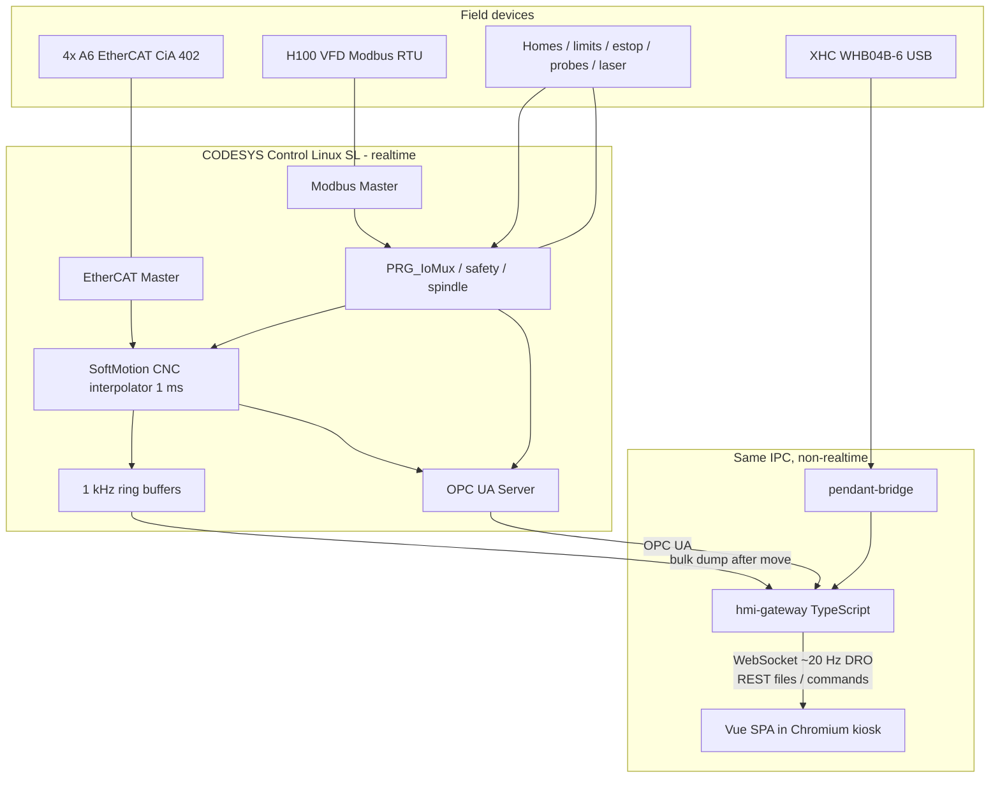
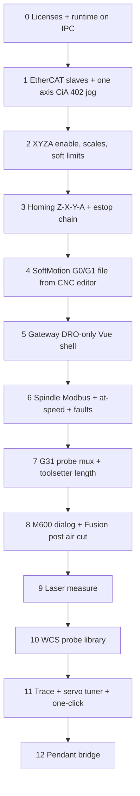

# Replicating this mill on CODESYS + a browser HMI

Yes — a browser HMI is the right call, as long as one rule is never broken:

**The browser paints. The PLC moves metal.**

E-stop, interpolator, probe latch, drive enables, and following-error trips stay on a real-time CODESYS runtime. The browser is a very fast remote control and dashboard. That split is what makes rapid UI prototyping safe instead of scary.

This page is the architecture and program map for porting **this repo’s features** (not “a generic CNC”) onto that stack. LinuxCNC stays the working machine until the CODESYS side can run air cuts.

Features should not be baked into one blob. A small kernel plus opt-in packs is in **[CODESYS_PLUGINS.md](CODESYS_PLUGINS.md)** (machine profile, contribution points, why we will not auto-scan folders).

---

## What “all these features” actually means

This mill is not just four servos and a G-code player. The current LinuxCNC config is a bundle of subsystems that have to be rebuilt as **IEC programs + a web app**, not copied as `.ngc` files.

| Area | What exists today | Why it matters on CODESYS |
|------|-------------------|---------------------------|
| Motion | XYZA `trivkins`, 1 ms servo, EtherCAT CiA 402 A6 drives | SoftMotion CNC interpolator + EtherCAT master |
| UI | Probe Basic (QtPyVCP): DRO, jog, AUTO/MDI, offsets, probe tab, custom tabs | Vue SPA replacing the whole shell |
| Tool length | `T n M600` → park, dialog, contact setter, `G10`/`G43` | M-function handler + G31 probe, not a LinuxCNC remap |
| Tool diameter | Kexin laser tab + `laser_*.ngc` + HAL mux | Same mux in ST; measure cycles as ST or CNC subprograms |
| Touch probe | Probe Basic pocket/boss/corner/angle macros (~50 `.ngc`) | ST probe library driven from HMI buttons |
| Spindle | H100 VFD over Modbus, 5 s at-speed delay, fault → estop | CODESYS Modbus master + same interlocks |
| Pendant | XHC WHB04B-6 USB + jog smoothing | Userspace bridge (no native CODESYS driver) |
| Tuning | Servo Tuning tab, one-click auto-tune, LLM clipboard loop | High-rate PLC trace + TypeScript FFT (not in the PLC) |
| Logging | HAL CSV + live plot up to 1 kHz | PLC ring buffer dump, not browser polling |
| CAM | Fusion post `linuxcnc-djr.cps` (M600, XYZA, G93) | New DIN 66025 / SoftMotion post |

---

## Recommended stack (the one that would actually impress people)

Skip CODESYS WebVisu as the main operator UI. It is fine for a maintenance page. It will not give you Probe Basic’s plots, a 3D backplot, or a week of UI iteration without touching the PLC.

**Pick this:**

| Layer | Choice | One-sentence why |
|-------|--------|------------------|
| PLC runtime | **CODESYS Control for Linux SL** (PREEMPT_RT) on the mill IPC | Same class of machine as today; EtherCAT on a dedicated NIC |
| Motion | **CODESYS SoftMotion CNC** | Real interpolator, lookahead, G-code, M-functions, G31 probing |
| Fieldbus | **CODESYS EtherCAT Master** + **Modbus RTU Master** | A6 drives and H100 VFD without IgH/`lcec`/`mb2hal` |
| Tag bus | **CODESYS OPC UA Server** | Industrial standard; HMI never talks EtherCAT |
| Gateway | **TypeScript + Hono + `node-opcua` + WebSocket** | Browser cannot speak OPC UA; this is the translator |
| HMI | **Vue 3 + TypeScript + Vite + Pinia + Tailwind + shadcn-vue** | Fastest path from “I have an idea” to a shop-floor screen |
| Charts | **uPlot** (FERR / torque) | Tiny and fast enough for live traces |
| Backplot | **Three.js** | 3D XYZA toolpath that Probe Basic cannot match |
| Repo layout | **pnpm workspace + `plugins/<id>/` packs** | Kernel apps + vertical feature slices; see [CODESYS_PLUGINS.md](CODESYS_PLUGINS.md) |

What those names mean if you are new to web tooling:

- **Vue** — the UI framework (buttons, DRO, tabs). A kiosk SPA is the right *kind* of app; Vue 3 is a strong default, not a law of physics — see [Why Vue](#why-vue-and-what-the-hmi-actually-is).
- **TypeScript** — JavaScript with types. Catches “wrote RPM into a bool” before you hit the machine.
- **Vite** — the dev server. Save a `.vue` file, the kiosk browser hot-reloads in milliseconds. That is the rapid prototyping.
- **Pinia** — the shared machine state in the browser (`estop`, `xpos`, `spindleRpm`…).
- **Tailwind / shadcn-vue** — styling without fighting CSS files. Dark mill theme in days, not months.
- **Hono** — a small TypeScript HTTP/WebSocket server. Not the motion controller.
- **OPC UA** — how respectable industrial software reads/writes PLC variables. Think “typed HAL pins over the network.”
- **pnpm** — installs JS packages once and shares them across `apps/hmi` and `apps/gateway`.

**Not Node-RED, not Next.js SSR, not putting the interpolator in JavaScript.** Node-RED is a glue toy. Next.js server-rendering does nothing useful on a shop kiosk. A browser cannot close a 1 ms position loop.

WebVisu can still ship as a **backup/maintenance page** (force enable, raw IO) so you can recover if the Vue stack is down.

---

## Why Vue (and what the HMI actually is)

Two different questions get mixed together.

### 1. Is a browser app the right *application*?

Yes, for the operator UI. The “application” on the mill is not Vue. It is:

| Process | Job |
|---------|-----|
| CODESYS runtime | Motion, IO, safety |
| Gateway | OPC UA ↔ WebSocket/REST |
| **Kiosk SPA** | Screens, plots, buttons |

A shop HMI is a **single-page app** that stays open for hours, pushes a DRO at ~20 Hz, and opens modals that must not lose state. It is not a marketing site, not a document CMS, not a server-rendered Next.js app.

Native Qt (Probe Basic today) is also a valid HMI. We are leaving it because iteration is slow and 3D/plotting/tablet access are painful. CODESYS WebVisu is a valid *industrial* HMI and a poor *product* HMI for this mill’s tuner/laser/probe density.

So: browser SPA = proper application type. Vue = one implementation of that type.

### 2. Why Vue 3 instead of React or Svelte?

Vue is the default because it fits this project, not because it is “more mill-correct” than React.

| | Vue 3 + Vite | React + Vite | Svelte 5 + Vite |
|--|--------------|--------------|-----------------|
| Kiosk SPA | Excellent | Excellent if you skip Next.js | Excellent |
| Beginner slope | Gentlest (templates + script) | Steeper (hooks, render model) | Small API, fewer tutorials |
| PLC-tag mental model | `ref` / `computed` ≈ watching a GVL | You invent that with stores | Runes are close too |
| 3D backplot / uPlot | All three wrap the same canvas libs | Same | Same |
| “Nerd default” 2026 | Strong | Strongest hiring pool | Fashion-forward, smaller bench |
| What would actually bite you | Fewer React-only examples | Easy to drag in Next.js SSR you do not need | Ecosystem for kits and hired help |

All three update a 20 Hz DRO without breaking a sweat. The 1 ms loop is not in the browser. Framework choice does not change EtherCAT, SoftMotion, or the plugin sockets.

**Why not React here:** React is a peer, not a mistake. The trap is *Next.js*, which optimizes for websites with server rendering. A mill kiosk has no SEO, no server HTML, and a WebSocket that must stay up. If you later prefer React, use **React + Vite + TanStack Router/Query**, not Next.

**Why not Svelte here:** It would get some nerds *more* excited (compiler, tiny bundle). It is a worse first bet for a beginner who will google “OPC UA websocket HMI” and find Vue/React answers. Revisit if the team already thinks in Svelte.

**Keep TypeScript + Vite + a store + uPlot + Three.js** whichever UI library you pick. That set is the actual HMI stack. Vue is the templating layer on top.

You mentioned Vue first; that is a real reason to pick it when the alternatives are ties. If you would rather write React, say so before stage 5. The PLC and gateway do not care.

---

## System architecture



Three processes, one IPC:

1. **CODESYS runtime** — hard realtime. Owns EtherCAT, interpolator, safety.
2. **`hmi-gateway`** — Node/Bun process. OPC UA client, WebSocket to browsers, G-code file drop, trace export, pendant ingest.
3. **Chromium kiosk** — the Vue HMI. Can also be a tablet on the shop LAN.

The pendant stays a small Linux userspace program (USB HID → gateway → OPC UA write of jog commands). CODESYS will not grow a WHB04B driver for free.

---

## Timing: what is fast, what is allowed to be slow

This is the difference between a mill and a web app.

| Signal | Rate | Where it lives | How the HMI sees it |
|--------|------|----------------|---------------------|
| Position command / CiA 402 PDO | 1 ms | SoftMotion + EtherCAT | Never in the browser |
| Probe / laser latch | drive / PLC task | `PRG_ProbeMux` + G31 | Result position, not the edge |
| E-stop / drive fault | PLC task | `PRG_Safety` | Status lamps |
| DRO, spindle RPM, overrides | 20–50 Hz | OPC UA subscription → WebSocket | Live labels |
| FERR / torque plot | 200–1000 Hz | PLC ring buffer | File/blob **after** the move (or a slow live downsample) |
| One-click tune FFT | after a stroke | gateway TypeScript | Same as today’s Python |
| G-code upload / tool table | on demand | REST | File picker |

Do **not** try to stream 1 kHz FERR through the browser as JSON. That is how the current Qt tab got laggy at 1000 Hz. Capture in the PLC, dump, plot.

---

## LinuxCNC vs SoftMotion: the dialect split

SoftMotion speaks **DIN 66025**, not LinuxCNC **RS274NGC**. You cannot drop `probe_basic/subroutines/*.ngc` onto the PLC and press Cycle Start.

| LinuxCNC today | SoftMotion equivalent |
|----------------|----------------------|
| `G0`/`G1`/`G2`/`G3` | Same idea; confirm dialect in CNC editor |
| `G38.2` / `G38.3` / `G38.5` | **`G31`** + `PROBE n` (“clear remaining distance”) |
| `M6` dialog + `REMAP=M600` | Interpolator `wM` / `bAcknM` + ST handler `PRG_MFunctions` |
| O-word `o<tool_touch_off> call` | ST function block **or** SoftMotion subprogram — ST is clearer for logic |
| `#5181` `#3014` `linuxcnc.var` | Persistent GVL / recipe / file |
| `G10 L20` / `G43` / `G92.1` | Work offsets + `SMC_ToolLengthCorr` / `SMC_ToolRadiusCorr` (verify license pack) |
| `G64 P0.001` | `SMC_SmoothPath` / `SMC_SmoothMerge` |
| `G93` inverse time (4th axis CAM) | Confirm SoftMotion inverse-time; may need post change to feed/min + rotary mapping |
| HAL `motion.probe-input` mux | `PRG_ProbeMux` selecting probe 1/2/3 into G31 |
| `halui` / `iocontrol` | OPC UA command structs (`Cmd.FeedHold`, `Cmd.Mdi`, …) |

CAM consequence: **`post-processor/linuxcnc-djr.cps` does not come along.** A Fusion post targeting SoftMotion/DIN + your M-codes is a first-class program in this port.

Probing on SoftMotion is real (example CNC 16): interpolator runs G31, PLC sees the probe DI, issues `bQuick_Stop`, copies actual position back into the interpreter, then `bAcknProbe`. That is the replacement for LinuxCNC’s built-in G38.

---

## Logical programs (what you actually write)

Think in four buckets. Names below are the working titles to use in the CODESYS tree and the pnpm apps.

### 1. CODESYS application (IEC Structured Text)

CODESYS “programs” are POUs. Use **Structured Text** everywhere (closest to Python; do not start in ladder unless you enjoy pain).

| POU | Cycle | Job |
|-----|-------|-----|
| `PRG_Safety` | 1 ms bus task | E-stop chain (Slave 3 DI1), drive faults, VFD 64/92 → disable |
| `PRG_Cia402` | 1 ms | CiA 402 state machine per axis, scale, 6065/6066 windows |
| `PRG_Interpolator` | 1 ms | `SMC_Interpolator` → axis setpoints |
| `PRG_Path` | slower task | `SMC_ReadNCFile2` + `SMC_NCInterpreter` + smoothers + lookahead queues |
| `PRG_Homing` | 1 ms | Z → X → Y → A sequence (A virtual-home like today) |
| `PRG_Jog` | 1 ms | GUI jog + pendant + incremental; gated by homed/enable |
| `PRG_IoMux` | 1 ms | Homes, limits (NC invert), software estop |
| `PRG_ProbeMux` | 1 ms | T99 → touch DI; else toolsetter DI; laser only while measure-active |
| `PRG_Spindle` | 10 ms | Modbus H100, M3/M4 map, ±50 RPM + 5 s at-speed |
| `PRG_MFunctions` | 1 ms | M0/M1/M3/M4/M5/M8/M9/M30, **M600**, M62/M63 laser gate, MDI pauses |
| `FB_ToolChange` | event | Retract → tool-load XY → wait HMI OK/Abort → setter → length → G43 |
| `FB_LaserMeasure` | event | Tip find, coarse locate, static-X peak hunt, beam cal |
| `FB_WcsProbe_*` | event | Port of Probe Basic pocket/boss/corner/edge routines |
| `PRG_Trace` | 1 ms | Ring buffers: 60F4 FERR, 6077 torque, 606C vel, actual pos |
| `PRG_CoeSdo` | background | Read/write A6 SDOs for the tuner (RAM vs EEPROM explicit) |
| `GVL_Machine` | — | The OPC UA surface: DRO, cmd bits, tool table, overrides |

Persistent data (today’s `linuxcnc.var` / `tool.tbl`):

- Tool table (T, D, Z, remark)
- WCS G54–G59
- Setter teach `#5181–#5183`
- Tool-load XY (270, 100)
- Probe params (feeds, clearances, probe tool number)
- Laser beam XY / width offset
- Tuning presets JSON (can stay on disk via gateway)

### 2. Gateway (`apps/gateway`)

| Module | Job |
|--------|-----|
| `opcua.ts` | Subscribe `GVL_Machine`, write commands, call PLC methods |
| `ws.ts` | Push DRO/status at ~20 Hz to all kiosk clients |
| `rest.ts` | G-code files, tool table, presets, traces, screenshots |
| `trace.ts` | Pull PLC ring buffer → CSV/JSON for plots and one-click tune |
| `pendant.ts` | Socket from `pendant-bridge` |
| `gcode.ts` | Drop file into SoftMotion NC directory, tell PLC to load |
| `auth.ts` | Shop-LAN only at first; later operator vs admin roles |

### 3. Vue HMI (`apps/hmi`) — screens that replace Probe Basic

| Route | Replaces | Notes |
|-------|----------|--------|
| `/` Manual | Main + XYZA DRO | Jog, WCS, **SET Z**, spindle, coolant, REF ALL |
| `/auto` | AUTO | File load, cycle start/hold/stop, feed/spindle override to 250%, 3D backplot |
| `/mdi` | MDI | History, single-block |
| `/offsets` | Offsets | G54–G59, tool table TDZR |
| `/tools` | Tool page | LOAD SPINDLE, UNLOAD, TOUCH OFF CURRENT TOOL |
| `/probe` | Probe tab | All WCS probe buttons; params panel |
| `/laser` | Laser Setter tab | Capture beam, measure diameter, calibrate |
| `/tune` | Servo Tuning tab | Pending gains, APPLY, FERR plot, one-click, inertia WIP |
| `/log` | Logging tab | Arm next program / live, axis+signal, uPlot |
| `/settings` | Machine settings | Scales, soft limits, bench flags (admin) |
| modal `ToolChange` | Custom M6 dialog | **OK** / **ABORT**; Esc does not dismiss |

Operator must-haves from this repo, not generic CNC chrome:

- SET Z → `G92.1` + set WCS Z (same as `set_wco_z.ngc`)
- Tool-load park ≠ setter park
- Abort mid-M600 retracts Z then parks tool-load XY
- Probe tool number in **three** places that must agree: tool table, persistent param, mux constant
- Spindle RPM from VFD feedback, load % from current

### 4. Side programs (keep them)

| Program | Language | Role |
|---------|----------|------|
| Fusion post `codesys-smc-xyza.cps` | JavaScript (Fusion) | M600, XYZA, no G49 after multi-axis, inverse-time policy |
| `pendant-bridge` | Python or Rust | WHB USB → gateway |
| `probe-beep` | Python | Optional click on probe/laser edge (can stay) |
| Auto-tune engine | TypeScript (port of `a6_auto_tune.py`) | Stimulus + FFT gate + notch + journaled revert |
| One-click dry-run | existing `--sim` idea | Desk demo without motion |

---

## Feature-complete map (LinuxCNC file → new home)

### Motion / IO (HAL + INI)

| Today | New home |
|-------|----------|
| `ethercat_mill.ini` axes, limits, homing | SoftMotion axis config + `GVL` + `PRG_Homing` |
| `ethercat-conf.xml` | CODESYS EtherCAT device tree + PDO/SDO |
| `ethercat_mill.hal` CiA 402 | `PRG_Cia402` |
| Probe mux, laser M62/M63 | `PRG_ProbeMux` |
| `custom.hal` VFD | `PRG_Spindle` |
| `xhc-whb04b-6.hal` | `pendant-bridge` |
| `probe_beep.hal` | optional host script |
| SDO 6065/6066 at start | `PRG_Cia402` init (do **not** reload loop gains every boot) |

### Tool change / length

| Today | New home |
|-------|----------|
| `m600.ngc` | M600 in `PRG_MFunctions` → `FB_ToolChange` |
| `tool_touch_off.ngc` | body of `FB_ToolChange` |
| `go_to_g30.ngc` / `abort_tool_change.ngc` | methods on that FB |
| `toolchange_dialog.py` | Vue modal |
| Fusion M600 post | new `.cps` |

### Laser

| Today | New home |
|-------|----------|
| `laser_setter.py` UI | `/laser` view |
| `laser_diameter.ngc` / `laser_static_edge.ngc` / `laser_length.ngc` | `FB_LaserMeasure` |
| HAL mux around G38 | mux around G31; static-X peak hunt stays a timed ST loop (not G-code) |

### Probe Basic WCS probing

Port as a **library of ST function blocks**, one per routine, parameters from GVL (today’s `#3000` range). The HMI only writes params and pulses `Cmd.ProbeRoundPocket`. Do not try to keep O-word.

Groups:

- Edges / WCO: `probe_x_plus`, `_minus`, `_wco`, same for Y/Z
- Corners / sides / inside corners
- Boss / pocket (round, rect), ridge, valley
- Calibration: round/square boss/pocket, cal reset
- Spindle nose (`probe_spindle_nose` — still abort if probe tool loaded)
- Metrology: `probe_z_three_samples`, `probe_z_repeat_stats`

ATC-shaped macros (`clamptool`, `extendatc`, carousel, …) stay **stubs** unless you add a real ATC. Today `POCKETS=1` and the tab is hidden.

### Tuning / logging

| Today | New home |
|-------|----------|
| `servo_tuner.py` | `/tune` + gateway |
| `a6_auto_tune.py` | `apps/gateway` or `packages/auto-tune` |
| `resonance_analysis.py` | same package (FFT stays off-PLC) |
| `hal_signal_logger.py` | `PRG_Trace` + `trace.ts` |
| `config/tuning/presets/` | keep JSON; gateway read/write |
| `docs/SERVO_TUNING_LLM.md` | unchanged playbook; HMI still COPY PLOT / COPY TUNING |

---

## What gets easier, what gets harder

**Easier on CODESYS**

- EtherCAT CoE SDO read/write for A6 tuning (no `lcec` SDO gymnastics)
- One vendor for master + interpolator + OPC UA
- Structured safety and M-function handling
- Multi-client HMI (tablet + IPC) for free

**Harder / easy to underestimate**

- SoftMotion is not LinuxCNC. Probe macros and the Fusion post are a rewrite.
- G31 probe acknowledge dance is more manual than G38.
- Inverse time `G93` + non-TCP 4th axis must be proven on air before any cut.
- SoftMotion CNC + EtherCAT licenses are real money.
- You will maintain **two** machines until the port is trusted (this LinuxCNC config stays source of truth).

**Do not port first:** conversational mill, image-to-gcode, ATC UI, inertia auto-tune (still WIP here).

---

## Hardware and licenses (order before writing UI)

1. IPC that already runs this mill, or a spare, with a dedicated NIC for EtherCAT.
2. CODESYS Development System (Windows IDE; talks to the Linux runtime).
3. Licenses: **Control for Linux SL**, **SoftMotion CNC**, **EtherCAT Master**, OPC UA (basic is often included; raise the tag limit if the default is tiny).
4. A6 ESI files / scan the bus; confirm VID/PID `00400000` / `00000715` still match.
5. Chromium kiosk on the IPC (`--kiosk http://127.0.0.1:5173` in dev, nginx-served `dist/` in production).

Safety stays physical: master estop cuts mains. Software estop is extra.

---

## Staged build path (do not start with Vue)

Same spirit as [GETTING_STARTED.md](GETTING_STARTED.md): one subsystem at a time.



The Vue app starts at stage 5 as a **DRO and e-stop lamp**. If you build `/tune` before an axis jogs, you will debug the wrong layer.

Suggested first Vue milestone (stage 5): Machine ON, estop, four DROs (actual mm/deg), homed bits, no jog until stage 3 is trusted from the CODESYS debugger.

---

## Proposed repo layout (when implementation starts)

Not created yet. When it is, keep it **beside** this LinuxCNC tree rather than mixing HAL with Vite configs.

```
machines/
  lemontart.yaml             # kernel + enabled plugin ids (the one enablement file)
codesys/
  LemontartMill.project/     # kernel POUs + linked feature libraries
apps/
  gateway/                   # kernel HTTP/WebSocket + plugin mount
  hmi/                       # Vue shell; routes come from enabled packs
packages/
  plugin-sdk/                # definePlugin(), registry, doctor
  machine-types/             # shared TypeScript types from GVLs
plugins/
  spindle-h100/              # plc/ + gateway/ + hmi/ + plugin.yaml
  toolchange-m600/
  laser-setter/
  wcs-probe/
  servo-tune/
  signal-log/
  pendant-whb/
post-processor/
  codesys-smc-xyza.cps
```

Enable a feature by adding its id to `machines/lemontart.yaml`, not by dropping a folder into a scanned directory. Details: [CODESYS_PLUGINS.md](CODESYS_PLUGINS.md).

The existing `probe_basic/` tree remains the behavior spec until each pack has a checkbox on the CODESYS side.

---

## Beginner glossary

| Term | Meaning |
|------|---------|
| PLC / runtime | The CODESYS process that must not miss a 1 ms cycle |
| POU | A program, function, or function block in the PLC project |
| GVL | Global Variable List — the shared “HAL pins” of CODESYS |
| SoftMotion CNC | CODESYS interpolator + G-code interpreter |
| OPC UA | Network protocol for reading/writing those GVL tags |
| Gateway | TypeScript process between OPC UA and the browser |
| WebSocket | Persistent pipe so the DRO updates without refresh |
| SPA | Single-page app: one Vue bundle, many routes |
| Vite | Dev server with instant hot reload |
| Kiosk | Full-screen Chromium on the mill PC |
| SDO / PDO | EtherCAT: PDOs every cycle (position); SDOs occasionally (gains) |
| M-function | G-code `M600` that pauses interpolation until ST acknowledges |
| Feature pack | Optional vertical slice (PLC + gateway + Vue) enabled in the machine profile |

---

## Decision log

| Decision | Choice | Rejected |
|----------|--------|----------|
| Operator HMI | Kiosk SPA in a browser | WebVisu as primary, Ignition, staying on QtPyVCP |
| UI library | Vue 3 + TS + Vite (default) | Next.js SSR; Svelte as first bet; React is a peer if it stays Vite |
| PLC language | Structured Text | Ladder, Python-on-PLC |
| Browser ↔ PLC | OPC UA → gateway → WebSocket | Polling REST for DRO, OPC UA from the browser, MQTT as the only bus |
| Probe cycles | ST FBs + G31 | Shipping LinuxCNC `.ngc` unchanged |
| Auto-tune math | TypeScript on gateway | FFT inside the PLC |
| Pendant | USB userspace bridge | Waiting for a CODESYS HID library |
| Features | Declared packs + kernel sockets | Probe Basic “load every `user_tabs` folder” |

If you swap Vue for React+Vite or Svelte, or wrap the kiosk in Tauri later, the PLC boundary does not change. Only `apps/hmi` does.

---

## Next concrete step

Do **not** scaffold the Vue app until stage 1 (one A6 jogging under CiA 402 in CODESYS) is true on the bench. The first document to write alongside the runtime is `GVL_Machine` — the tag list the HMI will bind to — so the web side can be mocked with fake OPC UA before the interpolator exists.

When the shell exists, add packs one at a time (`spindle-h100` first) against the sockets in [CODESYS_PLUGINS.md](CODESYS_PLUGINS.md). A curated catalog is a later product; do not start with an open plugin store.
