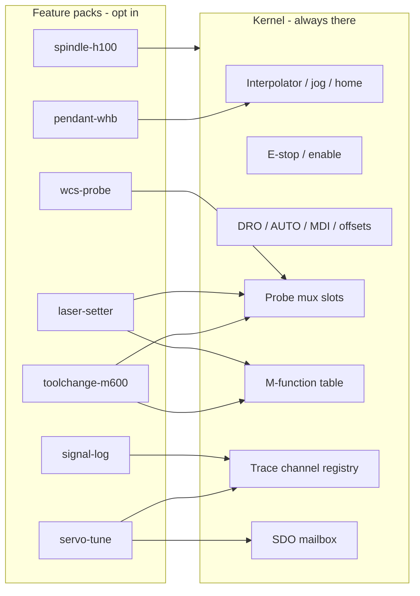

# Plugin architecture — base mill + independent features

The LinuxCNC tree in this repo is a **monolith with folders**. Probe Basic loads every `user_tabs/` directory; HAL files collide on `or2.0`; installing servo tuning means copying ten paths by hand; tool change is explicitly [not a tab drop-in](INSTALL_TOOL_CHANGE.md#what-this-is-not). A CODESYS + browser-HMI port should not repeat that.

The model: a **small kernel** that can jog, run G-code, and show a DRO, plus **feature packs** that opt into named sockets on that kernel. Enable a pack in one machine profile. Disable it, and its tab, tags, M-codes, and PLC calls disappear together.

This sits on top of [CODESYS_ARCHITECTURE.md](CODESYS_ARCHITECTURE.md). Same hard rule: plugins never own the interpolator.

---

## Why “copy a tab folder” is not a plugin

| What we do today | What goes wrong |
|------------------|-----------------|
| Probe Basic scans `user_tabs/` | Leftover empty folders from another branch crash startup |
| Tuner install = copy HAL + Python + UI + presets | Easy to miss a file; no dependency check |
| Tool change = HAL mux + `m600.ngc` + dialog + Fusion post | A UI folder cannot express that |
| Laser and contact probe share `motion.probe-input` | Features fight over a global pin unless the kernel arbitrates |
| `or2.0` vs `or2.1` reserved in HAL | No registry of “who owns this resource” |

A real plugin is a **vertical slice**: PLC + tags + gateway + HMI + persistence, registered through a **manifest**, turned on by a **machine profile**. Not a marketplace of random third-party widgets. Think VS Code contribution points, not WordPress themes.

---

## Kernel vs feature pack



**Kernel** (base installation): EtherCAT + CiA 402, XYZA limits, homing, jog, estop, work offsets, tool table *structure*, AUTO/MDI/file load, feed/spindle override, OPC UA heartbeat, HMI shell (Manual / Auto / MDI / Offsets / Settings). Plus empty **sockets**: probe sources, M-function slots, trace channels, CoE access, operator dialogs.

**Not in the kernel:** H100 register map, M600 dance, laser peak hunt, Probe Basic pocket routines, one-click FFT, WHB HID.

If someone clones the base and enables nothing extra, they get a mill that homes and runs a Fusion air cut with `M3`/`M5`/`M30` only. That is the point.

---

## Machine profile (the one file you edit)

Features are **declared**, never auto-discovered from the filesystem. That is the fix for the empty-`user_tabs` crash.

```yaml
# machines/lemontart.yaml
id: lemontart
kernel: mill-xyza
axes: [X, Y, Z, A]

plugins:
  - spindle-h100
  - toolchange-m600
  - laser-setter
  - wcs-probe
  - servo-tune
  - signal-log
  - pendant-whb
```

A second machine could be `plugins: [spindle-h100, toolchange-m600]` with no laser and no tuner. Same kernel binary/libraries, different profile.

A `plugin-doctor` command reads this file and fails the build if:

- a plugin depends on a kernel socket or another plugin that is not enabled
- two plugins claim `M62`, OPC UA prefix `Laser.`, or probe source id `laser`
- a plugin lists an HMI route `/tune` that another plugin also lists

That doctor is the HAL `or2` collision detector you wished you had.

---

## Contribution points (the sockets)

Each plugin exports one manifest. The kernel does not `import` laser internals. The laser pack **contributes** to sockets.

| Socket | Kernel provides | Plugin fills in |
|--------|-----------------|-----------------|
| `nav` / `routes` | React shell + router | `/laser`, `/tune`, `/probe` |
| `modals` | dialog host (OK / Abort, Esc policy) | M600 tool-change modal |
| `droExtras` | XYZA DRO | optional extras; SET Z stays kernel |
| `mFunctions` | dispatcher (`wM` / `bAcknM`) | `M600`, `M62`/`M63` |
| `probeSources` | mux: exactly one source owns G31 | `touch`, `toolsetter`, `laser` |
| `traceChannels` | 1 kHz ring buffer slots | `ferr.x`, `torque.z`, `vfd.rpm` |
| `coe` | SDO read/write mailbox | tuner gain objects |
| `opcua` | server + `GVL_Kernel` | `GVL_Laser`, `GVL_Tune` |
| `persist` | key/value file or recipe | `#5501+` laser params, presets JSON |
| `gatewayRoutes` | `/api/machine/*` | `/api/tune/one-click`, `/api/laser/hits` |
| `hostProcesses` | none | `pendant-bridge`, optional beep |

Example shape (TypeScript; PLC side is the same ids):

```ts
export default definePlugin({
  id: "laser-setter",
  version: "1.0.0",
  dependsOn: ["kernel.probeMux", "kernel.mFunctions"],
  contributes: {
    nav: [{ to: "/laser", label: "Laser" }],
    routes: [{ path: "/laser", component: "LaserView" }],
    probeSources: [{ id: "laser", exclusive: true }],
    mFunctions: [
      { m: 62, id: "laser.gateOn" },
      { m: 63, id: "laser.gateOff" },
    ],
    opcuaPrefix: "Laser",
    persistPrefix: "laser.",
  },
});
```

`dependsOn` is how laser is not allowed to poke `motion.probe-input` itself. It asks the mux for the `laser` slot; the mux decides whether G31 listens.

---

## One pack, three layers, same id

A feature is not “an HMI tab.” It is one package id in three trees:

```
plugins/laser-setter/
  plugin.yaml              # id, version, dependsOn, contributes
  plc/                     # CODESYS library: GVL_Laser, FB_LaserMeasure
  gateway/                 # Hono routes, OPC UA node list
  hmi/                     # React views, TanStack store
  persist.md               # keys and meaning (today’s #5501 table)
```

| Layer | How it loads |
|-------|----------------|
| HMI | Vite includes only packs listed in `machines/*.yaml`. No glob-all-folders. |
| Gateway | `registerPlugin()` mounts routes and OPC UA subscriptions for enabled ids |
| PLC | Feature library linked in the project; `PRG_Plugins` calls `FB_LaserMeasure` only when `GVL_Features.Laser` is TRUE |

HMI and gateway can hide a pack with **only** a profile edit. The PLC is stricter (next section).

---

## Honest CODESYS limit (do not pretend it is npm)

IEC code is compiled. You cannot USB-stick a new Structured Text file onto a running interpolator the way you drop a Probe Basic tab.

Practical pattern (what industrial people actually do):

1. **Ship kernel + all first-party libraries in the project.** Unused FBs sit idle behind `GVL_Features.*` bits. Enabling laser on a mill that already has the library is a config change + download, not a rewrite.
2. **Adding a brand-new pack** (one that was never compiled in) requires a CODESYS rebuild and download. That is expected.
3. **Never** put plugin business logic in the 1 ms interpolator task unless it is the mux/M-dispatcher itself. Feature FBs live in the slower path task or run as state machines that only *request* G31/jog from the kernel.

So “independent features” means **independent source and independent enablement**, not hot-plug DLLs on a 1 ms bus.

---

## How this mill’s features become packs

| Pack | Depends on | Owns | Today’s files (behavior spec) |
|------|------------|------|-------------------------------|
| `spindle-h100` | kernel spindle cmd/fb | Modbus map, 5 s at-speed, fault 64/92 | `custom.hal`, `h100.mb2hal` |
| `toolchange-m600` | probe mux, dialogs, M-dispatcher | park XY, setter G31, length write | `m600.ngc`, `tool_touch_off.ngc`, dialog |
| `laser-setter` | probe mux, M62/M63 | beam capture, static-X hunt | `laser_*.ngc`, `laser_setter.py` |
| `wcs-probe` | probe mux, probe tool # | pocket/boss/corner library | `probe_*.ngc` |
| `servo-tune` | trace, CoE mailbox | pending gains, one-click, LLM copy | `servo_tuner.py`, `a6_auto_tune.py` |
| `signal-log` | trace | CSV + live plot | `signal_monitor.py` |
| `pendant-whb` | kernel jog | USB HID bridge | `xhc-whb04b-6.hal` |

Shared resources that **must** stay kernel sockets:

- Probe / toolsetter / laser DIs → mux, not three features writing G31
- M-code numbers → dispatcher table
- Drive SDOs → one mailbox so tuner and startup 6065 do not stomp each other
- Operator Abort → one modal host with a documented Esc policy

`wcs-probe` and `toolchange-m600` both need the mux; neither imports the other. The probe tool number (today’s T99 / `#3014` / HAL constant) is a **kernel setting** that the mux and both packs read. Three places that must agree become one profile key.

---

## HMI and gateway: how enablement looks in code

Kernel shell:

```ts
// apps/hmi/src/plugins/load.ts
import profile from "../../../machines/lemontart.yaml";
import { registry } from "@lemontart/plugin-sdk";

for (const id of profile.plugins) {
  const pack = await import(`../../../plugins/${id}/hmi/index.ts`);
  registry.install(pack.default);
}

export const routes = [...kernelRoutes, ...registry.routes];
export const navItems = [...kernelNav, ...registry.nav];
```

Gateway:

```ts
for (const id of profile.plugins) {
  const pack = await import(`../../plugins/${id}/gateway/index.ts`);
  pack.default.mount(app, opcua);
}
```

The browser only receives tags under prefixes it subscribed to. A mill without `servo-tune` never sees `Tune.*` and never ships `/tune` in the JS bundle.

That last part is the rapid-prototyping win: a new pack is a new folder + one line in `lemontart.yaml`, not a tour of `App.tsx`, HAL, and INI.

---

## PLC composition

```
PRG_Main        (* 1 ms: safety, CiA 402, interpolator, mux, M-dispatcher *)
PRG_Path        (* background: NC decode *)
PRG_Plugins     (* enabled FBs only *)
  spindleH100()     if GVL_Features.SpindleH100
  toolChange()      if GVL_Features.ToolchangeM600
  laserMeasure()    if GVL_Features.Laser
  wcsProbe()        if GVL_Features.WcsProbe
```

`GVL_Features` is generated from the same YAML as the HMI loader (a small codegen step, or a checked-in ST file you regenerate when the profile changes). Do not hand-edit a second feature list.

Kernel mux sketch:

```
ProbeSource : (None, Touch, Toolsetter, Laser)
ActiveSource AT %MW0 : ProbeSource;   (* plugin requests, kernel grants *)
```

Laser measure requests `Laser`; M600 length probe requests `Toolsetter`; WCS routines request `Touch`. If two request at once, kernel denies and the HMI shows the conflict. Today that bug is a silent wrong DI.

---

## Marketplace vs catalog

Nothing is wrong with a **catalog**. That is the product shape if other mills ever run this: a list of first-party packs, compatibility with a kernel version, one-click enable in the profile, doctor checks, signed downloads.

What is wrong is treating a mill like VS Code’s marketplace on day one.

| | Curated catalog (good, later) | Open marketplace (bad on a mill) |
|--|-------------------------------|----------------------------------|
| Who publishes | You / reviewed vendors | Anyone with a zip |
| Install | Profile line + PLC download | “Install” while the interpolator is live |
| Trust | Signed, version-pinned to `kernel.probeMux@1` | Unsigned UI + ST that writes OPC UA commands |
| Hardware | Pack declares DI/SDO/slave needs | “Works on my machine” laser mux on the wrong pin |
| Failure mode | Doctor refuses a collision | Silent wrong probe source, or a tab that jogs |

A public store implies **hot-install of untrusted code that can command motion**. That is a different threat model from a color theme. CODESYS Store and Beckhoff’s catalog work because they are curated, licensed, and still require an engineering download — they are not npm.

Also: IEC cannot be USB-stick hot-plugged onto a 1 ms task. A marketplace UX that feels like “add laser from the shop floor, no rebuild” would be lying. The honest catalog still needs a PLC compile when a pack was never linked.

**Start:** in-tree packs + `machines/lemontart.yaml`.  
**Later, if this is a product:** a curated catalog UI that edits the same YAML, plus signed artifacts and a kernel API version.  
**Not:** an open store, USB-drop HMI packs on a running interpolator, plugins that call `SMC_Interpolator` directly, filesystem auto-discovery, or a “misc” pack for leftover buttons.

If a feature needs a new kernel socket (for example a second spindle), **extend the kernel on purpose** and bump a kernel API version. Packs depend on `kernel.probeMux@1`. That is how a future catalog stays safe.

---

## Staged adoption (matches the mill bring-up)

Do not design twenty packs on day one. Grow the sockets as the first packs need them.

| Stage | Kernel socket to add | First pack that proves it |
|-------|----------------------|---------------------------|
| Jog + DRO HMI | (none yet) | — |
| Spindle | spindle cmd/fb + fault → estop | `spindle-h100` |
| G31 | probe mux + M-dispatcher | `toolchange-m600` |
| Laser | mux slot `laser` + M62/M63 | `laser-setter` |
| WCS | same mux, `touch` slot | `wcs-probe` |
| Tuning | trace registry + CoE mailbox | `signal-log`, then `servo-tune` |
| Pendant | jog command ingress | `pendant-whb` |

The plugin SDK (`packages/plugin-sdk`) can start as a 50-line `definePlugin` + registry. Over-building it before one pack ships is how this turns into a framework nobody uses.

---

## Beginner glossary

| Term | Meaning |
|------|---------|
| Kernel | The mill that always exists: motion, safety, DRO, empty sockets |
| Feature pack / plugin | One optional capability with PLC + gateway + HMI together |
| Machine profile | YAML listing which packs this mill enables |
| Contribution point / socket | A named hook (mux slot, M-code, route) the kernel owns |
| Manifest | The pack’s `plugin.yaml` / `definePlugin()` listing what it hooks |
| Plugin doctor | Build check for collisions and missing dependencies |
| `GVL_Features` | PLC bits generated from the same profile |

---

## Decision log

| Decision | Choice | Rejected |
|----------|--------|----------|
| Enablement | Explicit profile list | Auto-scan folders |
| Plugin shape | Vertical slice (PLC+GW+UI) | UI-only tabs |
| Shared IO | Kernel mux / dispatcher | Each pack writes DIs and M-codes |
| PLC loading | Libraries + feature bits | Hot-plug ST at 1 ms |
| First packs | Map of this mill’s subsystems | Generic “user buttons” pack |
| Distribution | In-tree packs; curated catalog later | Open unsigned marketplace / hot-plug on a live interpolator |
