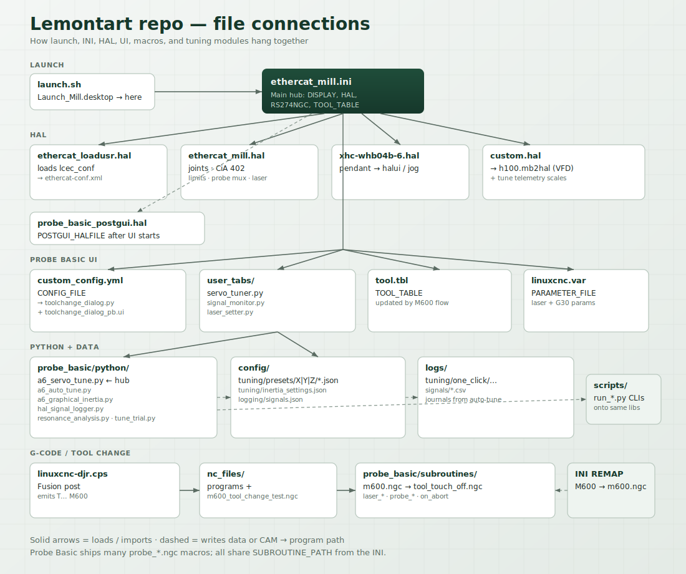
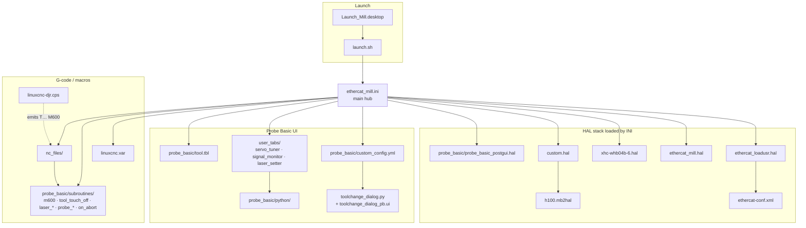
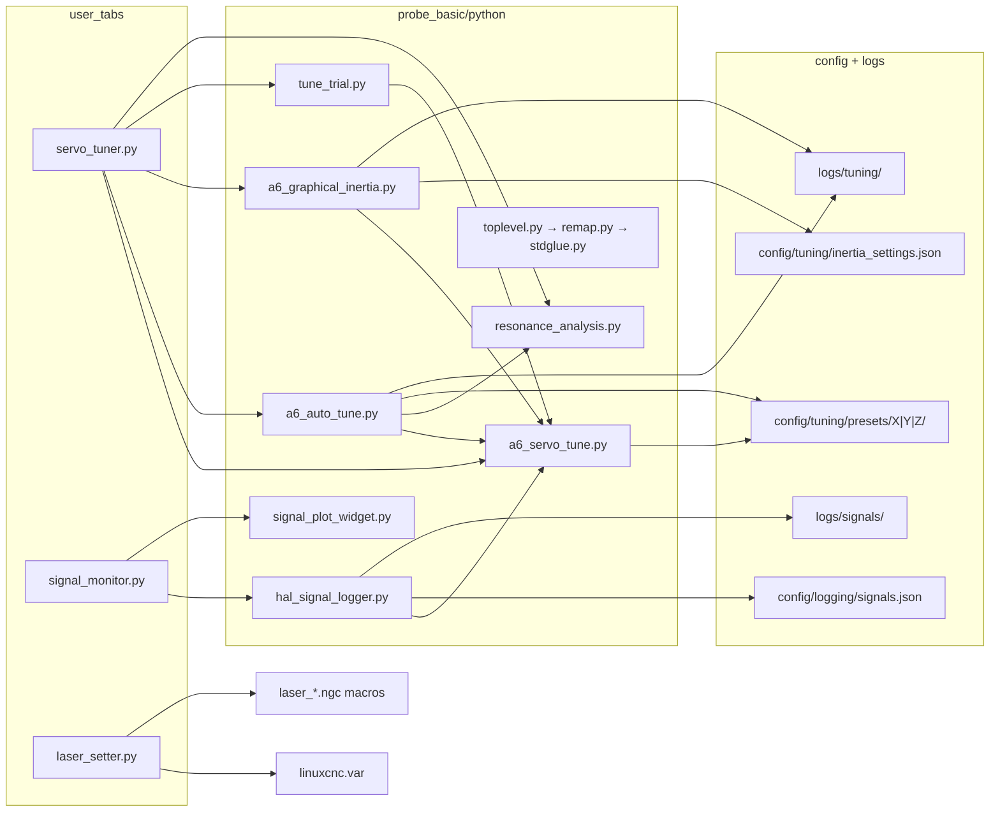
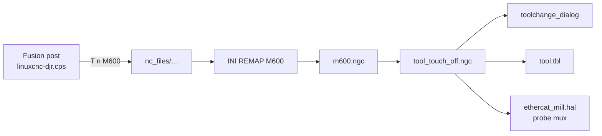

# File connection map

How the important files in this repo wire together. Probe macros under
`probe_basic/subroutines/` are collapsed into groups — there are dozens of
near-identical probe routines that all hang off the same INI path.

## Startup chain

| Step | File | Points at |
|------|------|-----------|
| 1 | `Launch_Mill.desktop` / `launch.sh` | `ethercat_mill.ini` |
| 2 | `ethercat_mill.ini` | HAL files, Probe Basic paths, tool table, subroutines, `nc_files/` |
| 3a | `ethercat_loadusr.hal` | `ethercat-conf.xml` (slave chain / SDOs) |
| 3b | `ethercat_mill.hal` | joints, CiA 402, limits, probe mux, laser pin |
| 3c | `xhc-whb04b-6.hal` | pendant → `halui` / jog nets |
| 3d | `custom.hal` | `h100.mb2hal` (VFD) + tune telemetry scales |
| 3e | `probe_basic_postgui.hal` | UI HAL pins after GUI starts |

## UI + Python

Helper scripts under `scripts/` are thin CLIs onto the same Python modules:

| Script | Uses |
|--------|------|
| `scripts/run_auto_tune.py` | `a6_auto_tune` + `a6_servo_tune` |
| `scripts/run_signal_logger.py` | `hal_signal_logger` |
| `scripts/plot_signal_log.py` | `config/logging/signals.json` + CSV logs |
| `scripts/visualize_auto_tune_scoring.py` | auto-tune + resonance + demo CSVs |
| `scripts/ui_smoke_servo_tuner_inertia.py` | `servo_tuner` layout smoke test |

## Tool-change path

## What is *not* wired in

- `docs/` — documentation only (this file included)
- `Sigma II Parameter Calculator Rev 2.42.xls`, `h100 manual.pdf` — reference manuals
- Stock Probe Basic probe `*.ngc` macros — all reached only via `SUBROUTINE_PATH`
