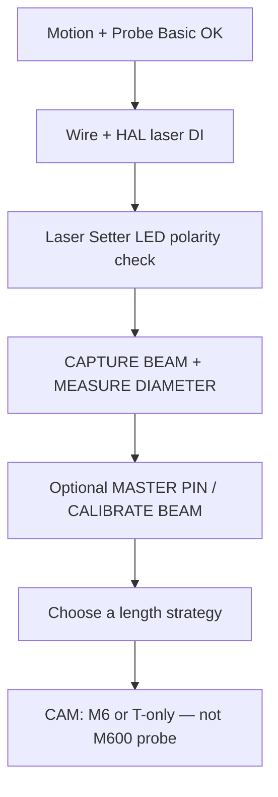

# Laser-only setup (no contact toolsetter)

This mill’s stock config assumes **both**:

| Sensor | Job today |
|--------|-----------|
| Contact toolsetter | Tool **length** → tool table via **M600** / LOAD SPINDLE |
| Kexin DS-5V-M laser | Tool **diameter** (and experimental length smoke tests) |

If you are copying this repo and you **only** have the laser U-slot — no contact
pad — this page is your path. Hardware install for the sensor itself is unchanged:
**[LASER_TOOL_SETTER.md](LASER_TOOL_SETTER.md)** (mount, 5 V wiring, level shift, HAL pin).

---

## Honest expectations (read this first)

| What you want | Status on this tree |
|---------------|---------------------|
| Measure **diameter** with the laser | **Supported** — Laser Setter tab + `laser_diameter.ngc` |
| Live beam LED / CAPTURE BEAM / beam-width cal | **Supported** |
| Auto tool **length** into the tool table from the laser | **Not implemented** |
| **MEASURE LENGTH** button | Experimental only — reports `beam_z − tip_z`; **does not** `G10` / touch the tool table |
| Contact **M600** / PROBE SPINDLE NOSE / SET TOOL TOUCH OFF POS | Requires a contact setter — **skip or remount** if you have none |

> **Rule of thumb:** with laser only, treat this repo as “Probe Basic + laser diameter.”
> Keep tool lengths in the table by hand (or a future laser-TLO macro — see
> [Toward laser TLO](#toward-laser-tlo-not-shipped-yet)).

Stock contact length flow remains documented in **[TOOLSETTER.md](TOOLSETTER.md)** /
**[INSTALL_TOOL_CHANGE.md](INSTALL_TOOL_CHANGE.md)** for machines that *do* have a pad.

---

## What to keep vs skip

### Keep

1. Motion / EtherCAT / Probe Basic bring-up — **[GETTING_STARTED.md](GETTING_STARTED.md)** stages 0–6.
2. Laser Setter tab + `laser_*.ngc` macros — install steps in
   [LASER_TOOL_SETTER.md § Installation](LASER_TOOL_SETTER.md#installation).
3. Manual tool-change **dialog** (`M6` OK) if you still change collets at a park position —
   you can keep the pause without probing length.
4. Touch probe (T99) routing **if** you have a separate work probe — length and
   work probing are different sensors.

### Skip (contact-only)

| Step / feature | Why |
|----------------|-----|
| Wire Slave 1 DI2 as toolsetter | No pad to trip |
| **SET TOOL TOUCH OFF POS** (`#5181–#5183`) | Contact setter XY/Z |
| **PROBE SPINDLE NOSE ZERO** (`#3010`) | Contact gauge line |
| **LOAD SPINDLE** / CAM **`T<n> M600`** length probe | Calls `tool_touch_off.ngc` → G38 on the contact pad → `G10` |
| `nc_files/m600_tool_change_test.ngc` as a length test | Will seek a pad that isn’t there |

---

## Recommended bring-up order (laser only)

1. **Get axes and Probe Basic stable** — same as any other install; ignore toolsetter
   teach until motion is trustworthy.
2. **Install the laser** — mount, 5 V power, Select→GND, level-shift to an A6 DI,
   net `laser-beam-broken` — [LASER_TOOL_SETTER.md](LASER_TOOL_SETTER.md).
3. **Smoke-test polarity** with `halcmd` (clear = FALSE, blocked = TRUE on
   `laser-beam-broken`).
4. **Diameter happy path** — CAPTURE BEAM → MEASURE DIAMETER → footer success /
   DIAMETER field updates.
5. **Pick how you will get lengths** (next section) before trusting multi-tool CAM.
6. **Point CAM at non-probing tool changes** — see [CAM](#cam--tool-change-without-a-contact-pad).

---

## Tool length without a contact pad

The laser **MEASURE LENGTH** path does **not** write `G10 L1`. Until a real
laser-TLO macro exists, pick one of these:

| Strategy | How | Good for |
|----------|-----|----------|
| **Manual tool table** | Measure offline (height gauge / presetter) → enter Z in Probe Basic tool table → `G43` on load | Most laser-only shops today |
| **Known stick-out** | Collet + fixed projection tools; enter lengths once | Repeat jobs, few cutters |
| **Single-tool jobs** | One length, touch off WCS Z on the part | Simple work |
| **M6 OK only** | CAM posts `T<n> M6`; you confirm change; lengths already in the table | Multi-tool without auto measure |
| **Future laser TLO** | Gauge-line teach + tip seek + `G10` — [below](#toward-laser-tlo-not-shipped-yet) | Not in this tree yet |

**Do not** run stock **M600** expecting length updates — it will drive to the taught
contact position and probe a sensor you do not have.

---

## HAL: laser-only (or laser + touch probe)

Stock `ethercat_mill.hal` muxes:

- Touch probe (T99) **or** contact toolsetter (any other tool) → contact arm  
- Laser onto `motion.probe-input` only while **M62 P0** is active during measure macros  

### Minimal change (keep stock mux, leave toolsetter DI unwired)

Leave the contact branch in place. An open / unused toolsetter DI that never trips
is fine **as long as you never run contact G38 length macros**. Laser measure still
uses **M62 P0** → **G38** → **M63 P0**.

Keep **`on_abort.ngc` → M63 P0`** so an abort cannot leave the laser latched onto
`motion.probe-input`.

### Cleaner laser-only probe-input (optional)

If you will never fit a contact pad:

1. Stop netting `lcec.*.di-*` for the toolsetter into the contact mux (or tie that
   and2 input inactive).
2. Keep touch-probe gating if you still use T99 for work probing.
3. Keep the laser **M62 P0** arm (`motion.digital-out-00` → `and2.7`) so diameter /
   length macros behave the same — or, if the laser is the *only* probe source,
   you can hard-wire `laser-beam-broken` → `motion.probe-input` and drop M62/M63
   (then edit macros to remove M62/M63 pairs; stock macros assume the mux).

Prefer the **minimal** path first; simplify HAL only after diameter measure is solid.

### Touch probe still present?

Keep the T99 compare (`probe-tool-num` / `comp.0`) so work-probe G38 does not listen
to the laser. Laser macros already gate contact off while measuring.

---

## Probe Basic / macros you can ignore

| UI / macro | Laser-only action |
|------------|-------------------|
| Tool Setter → SET TOOL TOUCH OFF POS | Skip |
| PROBE SPINDLE NOSE ZERO | Skip |
| LOAD SPINDLE (stock → M600 probe) | Prefer manual T + table lengths, or M6 OK only |
| TOUCH OFF CURRENT TOOL (contact) | Skip unless you add a pad later |
| Laser Setter tab | Use for diameter (and optional length experiments) |

Manual collet park + OK dialog can still be useful: retract → jog / G0 to a
tool-load XY → **M6** → confirm → continue, with lengths already correct in the table.

---

## CAM / tool change without a contact pad

Fusion post [`linuxcnc-djr.cps`](../linuxcnc-djr.cps) tool-change modes:

| Mode | Use when laser-only? |
|------|----------------------|
| **M600 — toolsetter probe** | **No** — probes contact pad + `G10` |
| **M6 — manual OK only** | **Yes** — change prompt; lengths from table |
| **T only** | **Yes** — you load/measure offline before the run |

Set the post to **M6** or **T only**, enter diameters from the laser (or catalog)
into the tool table, and enter lengths by your chosen strategy above.

---

## Day-one checklist (laser only)

- [ ] Machine homes / jogs; Probe Basic launches  
- [ ] Laser 5 V + Select→GND + level shift verified  
- [ ] `halcmd gets laser-beam-broken` matches clear vs blocked  
- [ ] Laser Setter LED tracks the beam  
- [ ] CAPTURE BEAM + **MEASURE DIAMETER** succeeds on a known pin  
- [ ] Optional: **CALIBRATE BEAM** so master pin reads back correctly  
- [ ] Tool table Z lengths filled (manual / presetter)  
- [ ] CAM posts **M6** or **T only**, not M600  
- [ ] Abort leaves mux restored (`M63 P0` in `on_abort.ngc`)  
- [ ] Contact teach / M600 length tests **not** on your punch list  

---

## Toward laser TLO (not shipped yet)

Roadmap item in [LASER_TOOL_SETTER.md](LASER_TOOL_SETTER.md): *Length → real TLO vs
gauge line*. Conceptually that means:

1. Teach a **gauge reference** once (spindle nose or master pin breaking the beam) —
   laser analog of contact `#3010`.
2. Tip-find at BEAM XY (existing `laser_length.ngc` seek).
3. `TLO = f(gauge_z, tip_z)` — not raw `beam_z − tip_z` alone.
4. On success: `G10 L1 P#5400 Z[...]` then `T#5400 G43 H#5400`.
5. Point LOAD SPINDLE / remap at that macro instead of contact `tool_touch_off.ngc`.

Until that lands, **MEASURE LENGTH** stays a polarity / seek smoke test only.

---

## Related docs

| Doc | Role |
|-----|------|
| [LASER_TOOL_SETTER.md](LASER_TOOL_SETTER.md) | Sensor install, diameter ops, params |
| [TOOLSETTER.md](TOOLSETTER.md) | Contact length / M600 (skip if no pad) |
| [INSTALL_TOOL_CHANGE.md](INSTALL_TOOL_CHANGE.md) | Copying contact M600 onto another mill |
| [GETTING_STARTED.md](GETTING_STARTED.md) | Full machine learning path |
| [DEVIATIONS.md](DEVIATIONS.md) | Probe mux / M62 P0 behavior vs stock |
