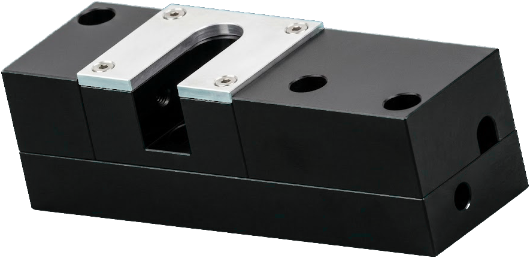

# Laser tool setter (Kexin DS-5V-M)

Measure tool **diameter** (and optionally experiment with length) using a cheap
U-slot laser beam sensor — without messing up your contact toolsetter.

**See also:** [TOOLSETTER.md](TOOLSETTER.md) (contact M600 length) ·
[PROBE_BASIC_UI.md](PROBE_BASIC_UI.md) · [README](../README.md)

---

## ELI5: what is this?

Imagine a tiny doorway with a laser tripwire across it. When a tool sticks into
the doorway and blocks the light, the sensor says “broken.” When the tool moves
out of the way, it says “clear.”

This mill uses that tripwire to:

1. Find the **tip** (lower until the beam breaks).
2. Sweep sideways to find the **left and right edges** of the tool.
3. Report how wide that shadow was — a raw **diameter**.

It has its **own** HAL signal (`laser-beam-broken`). It does **not** share
LinuxCNC’s `motion.probe-input` with the touch probe / contact setter, so the
two systems don’t fight each other.

> Contact toolsetter = “how long is this tool?”  
> Laser setter (today) = “how wide is this tool?” (raw; not beam-calibrated yet)

---

## What works today

| Feature | Status |
|---------|--------|
| Live beam LED on the tab | Works |
| **MEASURE DIAMETER** | Works |
| **CALIBRATE** / **MEASURE LENGTH** | Works, experimental (not a replacement for contact TLO) |
| Runout / broken-tool / air blast | Not built yet (roadmap only — no fake buttons) |

---

## Your machine layout (important)

On this mill the setter sits **lengthwise along Y**. The laser beam crosses the
slot in **X**.

So for diameter:

- **Y** ≈ center of the slot  
- **X START** = a spot **clear of the beam** (beside it, not on top of it)  
- Macro feeds **+X** toward / through the beam

The tab graphic labels the same idea:



| Label | Meaning |
|-------|---------|
| **START** | Where you CAPTURE — clear of the beam |
| **BEAM** | Where tip-find happens (`START + BEAM OFFSET`) |
| **MAX TRAVEL** | How far from START you’re willing to search — **stop before the far wall** |

---

## Measure diameter (happy path)

You need: machine on, homed enough to move, a cutter in the spindle, LinuxCNC
restarted after any HAL/tab change.

1. Jog **Y** to the middle of the U-slot.  
2. Jog **X** so the tool is **beside** the beam (clear — LED shows clear).  
   Eyeball ~10 mm off center is fine.  
3. Press **CAPTURE START (CLEAR OF BEAM)**.  
4. Set:
   - **BEAM OFFSET** — distance from START to the beam for tip-find (default `10`)
   - **MAX TRAVEL** — max +X from START; must clear the tool but stay short of the far wall (default `20`)
   - **Z DROP** — how far below the tip to sit for the side sweep (default `2`)
   - **PROBE RPM** — `0` = no spin; `>0` = reverse (**M4**) during the diameter pass  
5. Press **MEASURE DIAMETER**.  
6. Watch the footer status. On success, **DIAMETER** updates.

**Rule of thumb:** `BEAM OFFSET` must be **less than** `MAX TRAVEL`.

### What the macro does (plain English)

1. Goes to **G53 Z0** (safe height on this machine).  
2. Moves over the beam (`START + BEAM OFFSET`) and slowly lowers until the beam breaks → that’s the tip.  
3. Retracts to Z0, moves back to **START**, drops to tip − Z DROP.  
4. Creeps +X until the beam breaks (pre-touch), backs off 2 mm in X.  
5. Spins **M4** if you set an RPM.  
6. Creeps +X again: break → clear → width = diameter.  
7. Retracts to Z0 and stops the spindle.

If anything fails (never sees the beam, still in the beam at START, hits MAX TRAVEL
without clearing, etc.), it **retracts to Z0**, stops the spindle, and the footer
says it failed. It will **not** pretend the last good diameter is still valid.

---

## Optional: length experiments

**CALIBRATE** — jog the tip into the beam (LED = broken), press the button. Stores
machine Z as “beam plane.”

**MEASURE LENGTH** — seeks down onto the beam at `START + BEAM OFFSET` and reports
`beam_z − tip_z`. Useful for polarity / smoke tests. **Not** a spindle-nose TLO
replacement — keep using the contact setter + M600 for real tool lengths.

---

## Hardware / wiring (this mill)

| Item | Note |
|------|------|
| Sensor | Kexin **DS-5V-M** |
| Spec tool range | Ø 0.05–8 mm (bigger tools may still trip; MAX TRAVEL limits the sweep) |
| Power | **5 V** only — never feed 24 V into the sensor |
| Select | Tie to **GND** (0 V = ON) |
| Signal | Slave **2** `lcec.0.2.di-5` — DB15 **pin 11**, level-shift 5 V → 24 V |

### HAL picture

```
lcec.0.2.di-5 → not.10 → laser-beam-broken
                              ↑
                 tab LED + macros read this pin

contact probe / toolsetter → motion.probe-input   (laser never joins this)
```

`not.10` assumes the DI is TRUE when the beam is **clear** (common after a
high-side level shift). If measures never trip, polarity is wrong — remove
`not.10` and net DI5 straight to `laser-beam-broken`.

Results publish with `M68 E0` (value) and `M68 E1` (1 = success).

---

## Files involved

| Path | Role |
|------|------|
| `probe_basic/user_tabs/laser_setter/` | Tab UI + annotated PNG |
| `laser_diameter.ngc` | Diameter sequence |
| `laser_length.ngc` | Length experiment |
| `laser_set_start_xy.ngc` | START + RPM → `#5501–#5503` |
| `laser_set_diam_params.ngc` | Z DROP / MAX TRAVEL / BEAM OFFSET |
| `laser_set_beam_z.ngc` | BEAM Z for length |
| `ethercat_mill.hal` | `laser-beam-broken` net |

---

## Parameters (reference)

Laser uses **`#5501+`** on purpose so it never overwrites G30 / contact setter
teach (`#5181–#5186`) or ATC `M66` (`#5399`).

| # | Name | Meaning |
|---|------|---------|
| `#5501` / `#5502` | START X/Y | Clear of beam (G53 mm) |
| `#5503` | PROBE RPM | 0 = static; else M4 on measure |
| `#5504` | BEAM Z | Length only |
| `#5507` | Z DROP | Below tip for side sweep |
| `#5508` | MAX TRAVEL | Max +X from START |
| `#5509` | BEAM OFFSET | START → tip-find XY |
| `#5512` | Diameter | Last raw width |
| `#5515` | Success | 1 = OK (`M68 E1`) |

UI always syncs **millimeters** into these params, even if the Units combo shows inches.

Feeds use `#3004` / `#3005` when set; otherwise 200 / 40 mm/min.

---

## Troubleshooting

| What you see | Try this |
|--------------|----------|
| LED never changes | `halcmd getp laser-beam-broken` and `lcec.0.2.di-5`; Select tied to GND? 5 V power? |
| Tip-find never trips | BEAM OFFSET wrong, or polarity (`not.10`) |
| “Beam already broken at START” | START is still in the beam — jog farther clear |
| Never trips before MAX TRAVEL | Raise MAX TRAVEL (still short of the wall) or fix OFFSET / polarity |
| Never clears / oversize abort | Tool bigger than the travel window, or stop too short |
| Footer FAILED, old diameter gone | That’s correct — success is gated on `M68 E1` |
| Contact probe acting weird | Laser is **not** on `probe-input`; check the contact mux only |

---

## Roadmap

1. ~~HAL + LED + diameter~~  
2. ~~Off `probe-input`; START = clear of beam; MAX TRAVEL / BEAM OFFSET~~  
3. Beam-width / master-pin calibration (true diameter)  
4. Optional measure axis (X vs Y)  
5. Runout / broken-tool check  
6. Length → real TLO vs gauge line  
7. Air blast DO / controllable Select  

PRs welcome — especially calibration and safer travel limits for other mill layouts.
